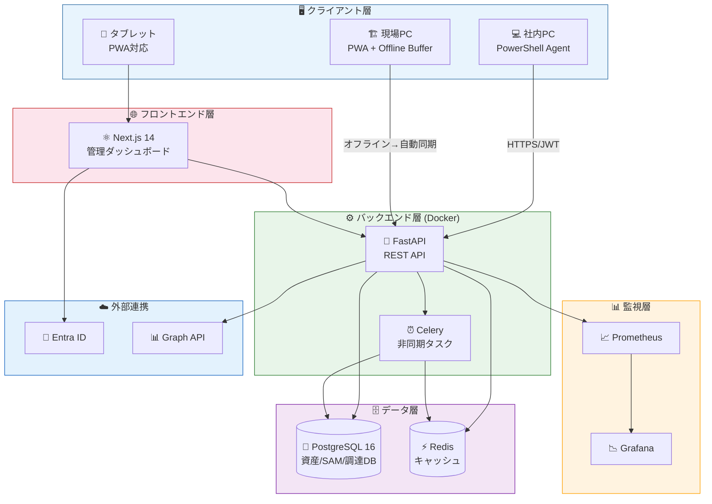
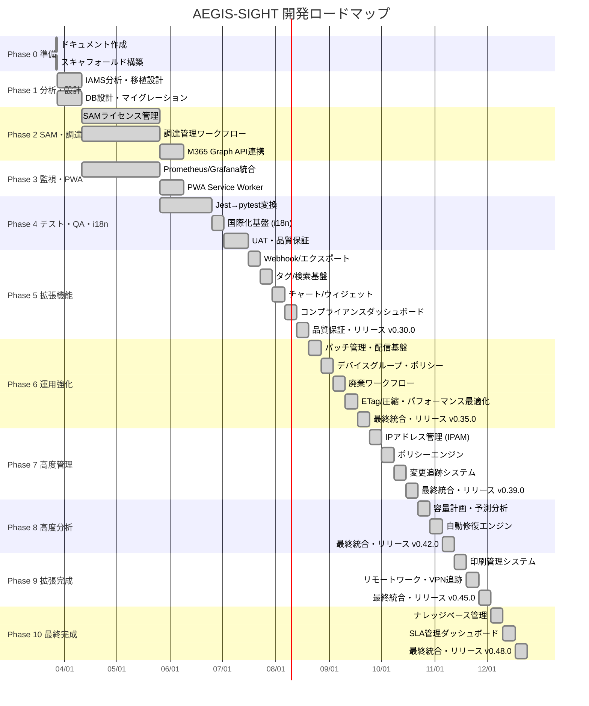
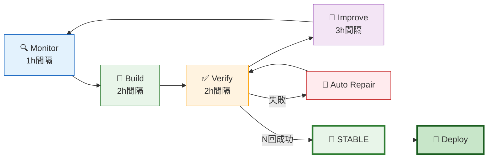

<div align="center">

```
 █████╗ ███████╗ ██████╗ ██╗███████╗      ███████╗██╗ ██████╗ ██╗  ██╗████████╗
██╔══██╗██╔════╝██╔════╝ ██║██╔════╝      ██╔════╝██║██╔════╝ ██║  ██║╚══██╔══╝
███████║█████╗  ██║  ███╗██║███████╗█████╗███████╗██║██║  ███╗███████║   ██║
██╔══██║██╔══╝  ██║   ██║██║╚════██║╚════╝╚════██║██║██║   ██║██╔══██║   ██║
██║  ██║███████╗╚██████╔╝██║███████║      ███████║██║╚██████╔╝██║  ██║   ██║
╚═╝  ╚═╝╚══════╝ ╚═════╝ ╚═╝╚══════╝      ╚══════╝╚═╝ ╚═════╝ ╚═╝  ╚═╝   ╚═╝
```

### Autonomous Endpoint Governance & Integrated Sight

**SKYSEA Client View 内製代替 + IAMS 選択移植**


[](https://github.com/Kensan196948G/AEGIS-SIGHT/actions)
[](https://github.com/users/Kensan196948G/projects/14)

</div>

---

## 📋 目次

- [概要](#-概要)
- [主要機能](#-主要機能)
- [システムアーキテクチャ](#-システムアーキテクチャ)
- [技術スタック](#-技術スタック)
- [ディレクトリ構成](#-ディレクトリ構成)
- [開発進捗](#-開発進捗)
- [ClaudeOS 自律開発](#-claudeos-自律開発)
- [クイックスタート](#-クイックスタート)
- [ドキュメント](#-ドキュメント)
- [コンプライアンス](#-コンプライアンス)

---

## 🎯 概要

| 項目 | 内容 |
|:---|:---|
| 🏷️ **プロジェクト名** | AEGIS-SIGHT |
| 🏢 **対象組織** | みらい建設工業（約550名） |
| 🖥️ **管理対象** | Windows 11/10 クライアントPC 約500台 + サーバ群 |
| 🌐 **環境** | 本社・支社・建設現場（拠点外）・テレワーク |
| 🛠️ **開発方式** | ClaudeOS v4 自律型開発（AI-Augmented Development） |
| 📊 **統合元** | IAMS (IntegratedITAssetServiceManagement) — 統合スコア 78/100 |
| 📅 **開発期間** | 全117フェーズ完了（Phase 0-117 Done）・IAMS pytest 1,798件移植完結・フロントエンド強化継続中 |

### 💡 なぜ AEGIS-SIGHT を作るのか

| 商用製品の課題 | AEGIS-SIGHT で解決 |
|:---|:---|
| 💰 ライセンスコスト継続発生 | 内製化で **70%以上コスト削減** |
| 🔒 組織固有要件への対応困難 | **完全カスタマイズ可能** |
| 🔗 Microsoft 365 との統合不足 | **Graph API でネイティブ統合** |
| 📋 J-SOX 監査証跡の不完全さ | **3年以上の証跡保全を保証** |
| 👷 IT 部門 5 名での運用限界 | **AI 自動化で工数 40%削減** |

---

## ✨ 主要機能

### 🖥️ 既存 AEGIS-SIGHT 機能

| 機能 | 説明 | 状態 |
|:---|:---|:---:|
| 📦 IT資産管理 | HW/SW情報自動収集（WMI/CIM） | ✅ Done |
| 📋 ログ管理 | ログオン/USB/ファイル操作追跡 | ✅ Done |
| 🛡️ セキュリティ監視 | Defender/BitLocker/パッチ管理 | ✅ Done |
| 📊 統合ダッシュボード | Next.js 14 リアルタイム可視化 | ✅ Done |
| 🖥️ デバイス管理画面 | デバイス一覧・詳細・フィルタ・HW情報（Phase B-5） | ✅ Done |
| 🔐 認証・RBAC | Entra ID SSO + 4ロール制御 | ✅ Done |

### 🔄 IAMS 選択移植機能

| 機能 | 説明 | 状態 |
|:---|:---|:---:|
| 📈 Prometheus/Grafana | インフラ可観測性・監視ダッシュボード | ✅ Done |
| 📱 PWA対応 | オフラインUI（建設現場対応） | ✅ Done |
| 🛒 調達管理 | 調達承認ワークフロー・ライフサイクルステッパー（Phase D-2） | ✅ Done |
| 📦 SAMライセンス管理 | 期限追跡・月額コスト分析・Badge統一（Phase D-1） | ✅ Done |
| 🧪 テスト資産変換 | **1,798件** Jest → pytest 変換 (Phase101-112完結) | ✅ Done |
| 🌐 国際化基盤 (i18n) | 日英メッセージカタログ + useTranslation hook | ✅ Done |
| 📝 Backendメッセージ | エラー/ドメインメッセージ日本語化 | ✅ Done |
| 📊 コンプライアンスダッシュボード | ISO 27001/J-SOX準拠状況可視化 | ✅ Done |
| 🔍 監査UI | 監査ログ検索・フィルタ・エクスポート | ✅ Done |
| 📄 レポートUI | 各種レポート生成・PDF/CSV出力 | ✅ Done |
| 🔧 パッチ管理 | OS/SWパッチ適用状況管理・自動配信 | ✅ Done |
| 📱 デバイスグループ | デバイスグループ管理・ポリシー適用 | ✅ Done |
| 🗑️ 廃棄ワークフロー | 資産廃棄申請・承認・証跡管理 | ✅ Done |
| ⚡ ETag/圧縮 | APIレスポンスキャッシュ・gzip圧縮最適化 | ✅ Done |
| 🌐 IPAM | IPアドレスプール管理・サブネット・VLAN | ✅ Done |
| 📜 ポリシーエンジン | ルールベースポリシー評価・違反検知 | ✅ Done |
| 🔄 変更追跡 | 構成変更自動検知・履歴管理・影響分析 | ✅ Done |
| 📈 容量計画 | リソース使用率トレンド分析・予測ダッシュボード | ✅ Done |
| 🔧 自動修復 | インシデント自動対応・修復アクション管理 | ✅ Done |
| 🖨️ 印刷管理 | プリンター資産管理・印刷ジョブ追跡・コスト集計 | ✅ Done |
| 🏠 リモートワーク | リモートワーク勤務状況ダッシュボード | ✅ Done |
| 🔐 VPN追跡 | VPN接続状況モニタリング・帯域使用率レポート | ✅ Done |
| 📚 ナレッジベース | 障害対応ナレッジ記事管理・全文検索・推薦 | ✅ Done |
| 📊 SLA管理 | SLA目標設定・達成率モニタリング・レポート | ✅ Done |

### ❌ IAMS から移植しない機能

| 機能 | 理由 |
|:---|:---|
| CMDB | AEGIS-SIGHT 本体と重複 |
| インシデント管理 | ITSM-System と重複 |
| SLA管理 | ITSM-System と重複 |
| 変更管理 | ITSM-System と重複 |

---

## 🏗️ システムアーキテクチャ



---

## 🔧 技術スタック

| レイヤー | 技術 | バージョン |
|:---|:---|:---|
| 🐍 **Backend** | FastAPI / SQLAlchemy / Alembic / Celery | Python 3.12 |
| ⚛️ **Frontend** | Next.js / TypeScript / Tailwind CSS | Next.js 14 |
| 🐘 **Database** | PostgreSQL / Redis | PG 16 / Redis 7 |
| 💻 **Agent** | PowerShell / Pester | PS 7.4 |
| 🐳 **Infrastructure** | Docker Compose / Nginx | Docker 27 |
| 📈 **Monitoring** | Prometheus / Grafana | Latest |
| 🔄 **CI/CD** | GitHub Actions | - |
| 🔐 **Auth** | JWT (RS256) / OIDC (Entra ID) | - |

---

## 📁 ディレクトリ構成

```
📦 AEGIS-SIGHT/
├── 🐍 aegis-sight-api/           # FastAPI バックエンド (~600ファイル)
│   ├── app/api/v1/               # REST API (200+エンドポイント)
│   │   ├── auth.py               #   認証 (JWT/OAuth2)
│   │   ├── assets.py             #   IT資産管理
│   │   ├── sam.py                #   SAMライセンス管理
│   │   ├── procurement.py        #   調達管理
│   │   ├── telemetry.py          #   エージェントテレメトリ受信
│   │   ├── dashboard.py          #   ダッシュボード統計
│   │   ├── security.py           #   セキュリティ監視
│   │   ├── logs.py               #   ログ管理
│   │   ├── software.py           #   SWインベントリ
│   │   └── metrics.py            #   Prometheus メトリクス
│   ├── app/models/               # SQLAlchemy モデル (10テーブル)
│   ├── app/services/             # ビジネスロジック (SAM/調達)
│   ├── app/tasks/                # Celery 非同期タスク (SAM日次照合)
│   ├── app/core/                 # 設定・認証・DB・例外・メッセージ・ページネーション・ミドルウェア
│   ├── alembic/                  # DBマイグレーション (2版)
│   ├── scripts/                  # シードデータ
│   └── tests/                    # pytest (100+ファイル, 850+テスト)
│
├── ⚛️ aegis-sight-web/           # Next.js 14 フロントエンド (~220ファイル)
│   ├── app/dashboard/            # ダッシュボード (45+ページ)
│   │   ├── page.tsx              #   統計概要 (API接続, 60秒自動更新)
│   │   ├── assets/               #   IT資産一覧 (検索/フィルタ/ページネーション)
│   │   ├── sam/                  #   SAM管理 (ライセンス/コンプライアンス/レポート)
│   │   ├── procurement/          #   調達管理 (申請/詳細/ワークフロー)
│   │   ├── logs/                 #   ログ管理 (ログオン/USB/ファイル)
│   │   ├── software/             #   SWインベントリ
│   │   ├── security/             #   セキュリティ概要
│   │   ├── monitoring/           #   Grafana監視
│   │   └── settings/             #   システム設定
│   ├── app/login/                # ログインページ
│   ├── components/ui/            # UIコンポーネント (9種)
│   ├── lib/                      # APIクライアント・型定義・認証コンテキスト・i18n
│   ├── e2e/                      # Playwright E2Eテスト
│   └── public/                   # PWA manifest / Service Worker
│
├── 💻 aegis-sight-agent/         # PowerShell Agent (12ファイル)
│   ├── src/                      # 収集モジュール (HW/SW/Log/Security)
│   ├── install/                  # インストーラ
│   └── tests/                    # Pester テスト
│
├── 🏗️ aegis-sight-infra/         # インフラ設定
│   ├── observability/            # Prometheus + Grafana
│   └── nginx/                    # リバースプロキシ
│
├── 📚 docs/                      # プロジェクトドキュメント (52ファイル)
│   ├── 01_計画フェーズ/          #   プロジェクト計画・WBS・リスク管理
│   ├── 02_ロードマップ/          #   Phase1-4 詳細計画
│   ├── 03_要件定義/              #   機能/非機能要件・受入条件
│   ├── 04_アーキテクチャ設計/    #   システム・API・DB・セキュリティ
│   ├── 05_詳細設計/              #   SAM・調達・監視・PWA
│   ├── 06_開発ガイド/            #   環境構築・規約・CI/CD
│   ├── 07_テスト計画/            #   テスト戦略・変換計画
│   ├── 08_リリース管理/          #   デプロイ・ロールバック
│   ├── 09_運用管理/              #   監視・バックアップ・SLA
│   ├── 10_コンプライアンス/      #   ISO27001・J-SOX・NIST CSF
│   └── 11_IAMS廃止計画/          #   移植チェック・データ移行
│
├── 🔧 scripts/                   # ClaudeOS 自動化スクリプト
├── 🔄 .github/workflows/         # CI/CD パイプライン
├── 🐳 docker-compose.yml         # 全サービス起動
├── 🐳 docker-compose.dev.yml     # 開発用 (ホットリロード)
├── 🐳 docker-compose.test.yml    # テスト用
└── 📋 CLAUDE.md                  # ClaudeOS プロジェクト設定
```

---

## 📊 開発進捗

### フェーズ計画



### 現在のステータス

| 項目 | 状態 | 詳細 |
|:---|:---:|:---|
| 📚 ドキュメント (60+ファイル) | ✅ Done | PR #2 merged |
| 🏗️ スキャフォールド (94ファイル) | ✅ Done | PR #4 merged |
| 🐍 Backend API (10ドメイン) | ✅ Done | auth/assets/sam/procurement/telemetry/dashboard/security/logs/software/metrics |
| ⚛️ Frontend (9ページ+ログイン) | ✅ Done | 全ページAPI接続済み |
| 🧪 テスト (850+ケース) | ✅ Done | pytest 100+ファイル + Vitest + Playwright E2E |
| 🐳 Docker/CI最適化 | ✅ Done | マルチステージ, セキュリティスキャン, dependabot |
| 📊 GitHub Projects | ✅ Active | [司令盤 #14](https://github.com/users/Kensan196948G/projects/14) |
| 🔄 CI/CD | ✅ Passing | GitHub Actions (lint/test/build/security) |
| 📋 監査証跡・レポート | ✅ Done | 監査API + CSV/JSONエクスポート + 通知サービス |
| 🔔 アラート・ユーザー管理 | ✅ Done | CRUD + acknowledge/resolve + ロール管理 |
| 🏢 部門・バッチ・ヘルスチェック | ✅ Done | 階層部門 + CSV一括処理 + K8s probe |
| ⚙️ 設定・ネットワーク探索 | ✅ Done | key-value設定 + MAC UPSERT + unmanaged検出 |
| ☁️ M365連携・WebSocket | ✅ Done | Graph API + リアルタイム通知 + スケジューラ |
| 🧪 統合テスト・RBAC | ✅ Done | 6シナリオ + 4ロール検証 + OpenAPI強化 |
| 🌐 国際化基盤 (i18n) | ✅ Done | Backend メッセージ日本語化 + Frontend 日英カタログ + useTranslation hook |
| 🔗 Webhook/エクスポート | ✅ Done | Webhook配信 + CSV/JSON/PDFエクスポート |
| 🏷️ タグ/検索基盤 | ✅ Done | 資産タグ管理 + 全文検索 + フィルタ強化 |
| 📊 チャート/ウィジェット | ✅ Done | ダッシュボードウィジェット + リアルタイムチャート |
| 📋 コンプライアンスダッシュボード | ✅ Done | ISO 27001/J-SOX準拠状況可視化 + 監査UI + レポートUI |
| 🔧 パッチ管理 | ✅ Done | OS/SWパッチ適用状況管理・自動配信基盤 |
| 📱 デバイスグループ | ✅ Done | デバイスグループ管理・ポリシー適用 |
| 🗑️ 廃棄ワークフロー | ✅ Done | 資産廃棄申請・承認・証跡管理 |
| ⚡ ETag/圧縮 | ✅ Done | APIレスポンスキャッシュ・gzip圧縮最適化 |
| 🌐 IP管理 (IPAM) | ✅ Done | IPアドレスプール管理・サブネット・VLAN |
| 📜 ポリシーエンジン | ✅ Done | ルールベースポリシー評価・違反検知・自動通知 |
| 🔄 変更追跡 | ✅ Done | 構成変更自動検知・履歴管理・影響分析 |
| 📈 容量計画・予測分析 | ✅ Done | リソース使用率トレンド分析・予測ダッシュボード |
| 🔧 自動修復エンジン | ✅ Done | インシデント自動対応・修復アクション管理 |
| 🖨️ 印刷管理 | ✅ Done | プリンター資産管理・印刷ジョブ追跡・コスト集計 |
| 🏠 リモートワーク・VPN追跡 | ✅ Done | VPN接続モニタリング・リモートワーク勤務状況 |
| 📚 ナレッジベース管理 | ✅ Done | 障害対応ナレッジ記事管理・全文検索・推薦 |
| 📊 SLA管理ダッシュボード | ✅ Done | SLA目標設定・達成率モニタリング・レポート |
| 🎯 最終統合 v0.48.0 | ✅ Done | 全48 Phase完了・最終リリース |
| 🚀 **Phase50 本番デプロイ準備** | ✅ **Done** | deploy-prod.yml・Grafanaアラート強化 (22ルール)・IAMSデータ移行スクリプト (PR#117 merged) |
| 🔧 **Phase51 依存関係更新・ステージング** | ✅ **Done** | Actions PR#13,#15,#17,#18 マージ済み・npm major PRリスク評価済み・ドキュメント更新 (PR#119 merged) (Issue#118) |
| 🧪 **Phase101-112 IAMS pytest移植完結** | ✅ **Done** | 累計1,798件テスト (PR#173-184) — 1,157件目標比 +641件超過達成 |
| 🖥️ **Phase113 フロントエンドPhase B-5** | ✅ **Done** | デバイス管理画面実装（一覧・詳細・サイドバー追加）(PR#185) |

### GitHub Issues トラッカー

| # | タイトル | Phase | 状態 |
|:--|:---|:---|:---:|
| [#1](https://github.com/Kensan196948G/AEGIS-SIGHT/issues/1) | 全ドキュメント作成 | Done | ✅ |
| [#3](https://github.com/Kensan196948G/AEGIS-SIGHT/issues/3) | Phase1 スキャフォールド | Done | ✅ |
| [#5](https://github.com/Kensan196948G/AEGIS-SIGHT/issues/5) | Phase2 Backend深化 | Done | ✅ |
| [#7](https://github.com/Kensan196948G/AEGIS-SIGHT/issues/7) | Phase3 テスト基盤・API追加 | Done | ✅ |
| [#9](https://github.com/Kensan196948G/AEGIS-SIGHT/issues/9) | Phase4 ログ/SW API・DevOps | Done | ✅ |
| [#30](https://github.com/Kensan196948G/AEGIS-SIGHT/issues/30) | Phase6 監査・通知・レポート | Done | ✅ |
| [#32](https://github.com/Kensan196948G/AEGIS-SIGHT/issues/32) | Phase7 アラート・ユーザー管理 | Done | ✅ |
| [#34](https://github.com/Kensan196948G/AEGIS-SIGHT/issues/34) | Phase8 部門・バッチ・ヘルスチェック | Done | ✅ |
| [#36](https://github.com/Kensan196948G/AEGIS-SIGHT/issues/36) | Phase9 CI修復・設定・ネットワーク | Done | ✅ |
| [#38](https://github.com/Kensan196948G/AEGIS-SIGHT/issues/38) | Phase10 M365・WebSocket・スケジューラ | Done | ✅ |
| [#40](https://github.com/Kensan196948G/AEGIS-SIGHT/issues/40) | Phase11 統合テスト・RBAC・OpenAPI | Done | ✅ |
| [#42](https://github.com/Kensan196948G/AEGIS-SIGHT/issues/42) | Phase12 README最終更新・品質強化 | Done | ✅ |
| - | Phase13-25 国際化基盤・メッセージ日本語化・全機能完了 | Done | ✅ |
| - | Phase26 Webhook配信・エクスポート機能 | Done | ✅ |
| - | Phase27 タグ管理・全文検索基盤 | Done | ✅ |
| - | Phase28 チャート/ウィジェットシステム | Done | ✅ |
| - | Phase29 コンプライアンスダッシュボード・監査UI | Done | ✅ |
| - | Phase30 最終品質保証・リリース v0.30.0 | Done | ✅ |
| - | Phase31 パッチ管理・配信基盤 | Done | ✅ |
| - | Phase32 デバイスグループ・ポリシー管理 | Done | ✅ |
| - | Phase33 廃棄ワークフロー | Done | ✅ |
| - | Phase34 ETag/圧縮・パフォーマンス最適化 | Done | ✅ |
| - | Phase35 最終統合・リリース v0.35.0 | Done | ✅ |
| - | Phase36 IPアドレス管理 (IPAM) | Done | ✅ |
| - | Phase37 ポリシーエンジン | Done | ✅ |
| - | Phase38 変更追跡システム | Done | ✅ |
| - | Phase39 最終統合・リリース v0.39.0 | Done | ✅ |
| - | Phase40 容量計画・予測分析 | Done | ✅ |
| - | Phase41 自動修復エンジン | Done | ✅ |
| - | Phase42 最終統合・リリース v0.42.0 | Done | ✅ |
| - | Phase43 印刷管理システム | Done | ✅ |
| - | Phase44 リモートワーク・VPN追跡 | Done | ✅ |
| - | Phase45 最終統合・リリース v0.45.0 | Done | ✅ |
| - | Phase46 ナレッジベース管理 | Done | ✅ |
| - | Phase47 SLA管理ダッシュボード | Done | ✅ |
| - | Phase48 最終統合・リリース v0.48.0 | Done | ✅ |
| [#116](https://github.com/Kensan196948G/AEGIS-SIGHT/issues/116) | **Phase50 本番デプロイ準備・IAMS統合完成** | Done | ✅ |
| [#118](https://github.com/Kensan196948G/AEGIS-SIGHT/issues/118) | **Phase51 依存関係更新・ステージング環境・pytest変換計画** | **In Progress** | 🔄 |

---

## 🤖 ClaudeOS 自律開発

### 開発ループ



### 本日のタイムスケジュール (2026-03-27)

| 時間 (JST) | ループ | 内容 | PR | 状態 |
|:---|:---|:---|:---:|:---:|
| 08:33 | 🟢 開始 | ClaudeOS Boot | - | ✅ |
| 08:33-08:50 | 📚 Build | ドキュメント52ファイル作成 | #2 | ✅ |
| 08:50-09:15 | 🔨 Build | Phase1 スキャフォールド94ファイル | #4 | ✅ |
| 09:15-09:35 | 🔍 Monitor | リポジトリ状態確認・GitHub Projects #14 設定 | - | ✅ |
| 09:35-09:40 | 🔨 Build | Phase2 Backend/Frontend深化 | #6 | ✅ |
| 09:40-09:45 | 🔨 Build | Phase3 テスト基盤・API追加 | #8 | ✅ |
| 09:45-09:50 | 🔧 Improve | Phase4 ログ/SW API・Docker/CI最適化 | #10 | ✅ |
| 09:50-09:57 | 🔧 Improve | Phase5 Frontend統合・テスト76ケース | #29 | ✅ |
| 09:57-10:05 | 🔧 Improve | Phase6 監査証跡・通知・レポート | #31 | ✅ |
| 10:05-10:15 | 🔧 Improve | Phase7 アラート管理・ユーザー管理 | #33 | ✅ |
| 10:15-10:22 | 🔧 Improve | Phase8 部門管理・バッチ処理・ヘルスチェック | #35 | ✅ |
| 10:22-10:28 | 🔧 Improve | Phase9 CI修復・設定管理・ネットワーク探索 | #37 | ✅ |
| 10:28-10:32 | 🔧 Improve | Phase10 M365連携・WebSocket・スケジューラ | #39 | ✅ |
| 10:32-10:35 | ✅ Verify | Phase11 統合テスト・RBAC・OpenAPI | #41 | ✅ |
| 10:35-10:40 | 🔧 Improve | Phase12 README最終更新・品質強化 | - | ✅ |
| 10:40-12:00 | 🔨 Build | Phase13-20 継続実装・テスト拡充 | - | ✅ |
| 12:00-12:30 | 🔍 Monitor | 中間レポート | - | ✅ |
| 12:30-15:00 | 🔧 Improve | Phase21-24 品質改善・国際化基盤 | - | ✅ |
| 15:00-16:00 | ✅ Verify | Phase25 STABLE判定・最終テスト | - | ✅ |
| 16:00-16:30 | 🔍 Monitor | 最終レポート・安全停止 | - | ✅ |
| 16:33 | 🔴 終了 | 8時間制限到達（Session 1） | - | ✅ |
| --- | --- | --- | --- | --- |
| 2026-03-27 | 🟢 Session 2 | Phase26-30 拡張開発セッション | - | ✅ |
| - | 🔨 Build | Phase26 Webhook配信・エクスポート機能 | - | ✅ |
| - | 🔨 Build | Phase27 タグ管理・全文検索基盤 | - | ✅ |
| - | 🔨 Build | Phase28 チャート/ウィジェットシステム | - | ✅ |
| - | 🔨 Build | Phase29 コンプライアンスダッシュボード・監査UI | - | ✅ |
| - | ✅ Verify | Phase30 最終品質保証・README更新・v0.30.0リリース | - | ✅ |
| --- | --- | --- | --- | --- |
| 2026-03-27 | 🟢 Session 3 | Phase31-35 運用強化セッション | - | ✅ |
| - | 🔨 Build | Phase31 パッチ管理・配信基盤 | - | ✅ |
| - | 🔨 Build | Phase32 デバイスグループ・ポリシー管理 | - | ✅ |
| - | 🔨 Build | Phase33 廃棄ワークフロー | - | ✅ |
| - | 🔨 Build | Phase34 ETag/圧縮・パフォーマンス最適化 | - | ✅ |
| - | ✅ Verify | Phase35 最終統合・リリース v0.35.0 | - | ✅ |
| --- | --- | --- | --- | --- |
| 2026-03-27 | 🟢 Session 4 | Phase36-39 高度管理セッション | - | ✅ |
| - | 🔨 Build | Phase36 IPアドレス管理 (IPAM) | - | ✅ |
| - | 🔨 Build | Phase37 ポリシーエンジン | - | ✅ |
| - | 🔨 Build | Phase38 変更追跡システム | - | ✅ |
| - | ✅ Verify | Phase39 最終統合・リリース v0.39.0 | - | ✅ |
| --- | --- | --- | --- | --- |
| 2026-03-27 | 🟢 Session 5 | Phase40-42 最終完成セッション | - | ✅ |
| - | 🔨 Build | Phase40 容量計画・予測分析 | - | ✅ |
| - | 🔨 Build | Phase41 自動修復エンジン | - | ✅ |
| - | ✅ Verify | Phase42 最終統合・リリース v0.42.0 | - | ✅ |
| --- | --- | --- | --- | --- |
| 2026-03-27 | 🟢 Session 6 | Phase43-45 最終完成セッション | - | ✅ |
| - | 🔨 Build | Phase43 印刷管理システム | - | ✅ |
| - | 🔨 Build | Phase44 リモートワーク・VPN追跡 | - | ✅ |
| - | ✅ Verify | Phase45 最終統合・リリース v0.45.0 | - | ✅ |
| --- | --- | --- | --- | --- |
| 2026-03-27 | 🟢 Session 7 | Phase46-48 最終完成セッション | - | ✅ |
| - | 🔨 Build | Phase46 ナレッジベース管理 | - | ✅ |
| - | 🔨 Build | Phase47 SLA管理ダッシュボード | - | ✅ |
| - | ✅ Verify | Phase48 最終統合・リリース v0.48.0 | - | ✅ |
| --- | --- | --- | --- | --- |
| 2026-04-02 | 🟢 **Session 8** | **Phase50 本番デプロイ準備セッション** | - | ✅ |
| 08:21 JST | 🔍 Monitor | ClaudeOS Boot・GitHub/CI状態確認 | - | ✅ |
| 08:21-08:40 | 🔨 Build | Trivy @0.28.0→@master修正・Prometheusアラート強化 (22ルール) | - | ✅ |
| 08:35 JST | 🚀 Build | PR#117 push (Phase50 本番デプロイ準備) | #117 | ✅ |
| 08:40 JST | ✅ Verify | STABLE N=2 達成・PR#117 merged | #117 | ✅ |
| 08:42 JST | 🔧 Improve | Phase51 Issue#118作成・監視設計書更新・PR#16マージ | #118 | ✅ |
| 08:50 JST | 🔧 Improve | npm major PR #22,#24,#25,#26 リスクコメント | - | ✅ |
| 09:00 JST | 🔧 Improve | PR#119 docs フェーズ完了・Phase51計画 push | #119 | ✅ |
| 09:05 JST | 🔧 Improve | Actions PR #13,#15,#17,#18 CI確認・マージ | - | ✅ |
| 09:10 JST | 🔧 Improve | npm major PR #19,#20,#21,#23,#27,#28 リスクコメント | - | ✅ |
| 09:15 JST | 🔧 Improve | PR#119 CI全通過・マージ完了 (docs Phase51) | #119 | ✅ |
| 09:30 JST | 🔧 Improve | AlertManager設定・docker-compose更新・Secrets手順書作成 | - | ✅ |
| 09:50 JST | 🔧 Improve | PR#120 CI全通過・マージ完了 (AlertManager+docs) | #120 | ✅ |
| 10:00-10:20 JST | 🔧 Improve | Phase52: AlertManager Grafana統合・CI修正・SAM期限アラートAPI | #122 | ✅ |
| 10:20 JST | 🔧 Improve | PR#122 CI全通過・maim マージ完了 (Phase52) | #122 | ✅ |
| 10:30-10:45 JST | 🔧 Improve | Phase53: IAMS pytest変換 Phase1（70件）tests/iams/ 新設 | #124 | ✅ |
| 10:45 JST | 🔧 Improve | PR#124 CI全通過・main マージ完了 (Phase53) | #124 | ✅ |
| 11:00-11:20 JST | 🔧 Improve | Phase54: IAMS pytest Phase2 資産管理テスト52件 | #125 | ✅ |
| 11:20 JST | 🔧 Improve | PR#125 CI全通過・main マージ完了 (Phase54) | #125 | ✅ |
| 11:30-11:50 JST | 🔧 Improve | Phase55: IAMS pytest Phase3 SAMライセンス管理テスト48件 | #126 | ✅ |
| 11:50 JST | 🔧 Improve | PR#126 CI全通過・main マージ完了 (Phase55) | #126 | ✅ |
| 12:00-12:20 JST | 🔧 Improve | Phase56: IAMS pytest Phase4 ユーザー管理テスト45件 | #127 | ✅ |
| 12:20 JST | 🔧 Improve | PR#127 CI全通過・main マージ完了 (Phase56) | #127 | ✅ |
| 12:30-12:50 JST | 🔧 Improve | Phase57: IAMS pytest Phase5 通知管理テスト50件 | #128 | ✅ |
| 12:50-13:10 JST | 🔧 Improve | Phase58: IAMS pytest Phase6 調達管理テスト33件 | #129 | ✅ |
| 13:10-13:20 JST | 🔧 Improve | Phase59: IAMS pytest Phase7 監査ログ・コンプライアンステスト40件 | #130 | ✅ |
| 13:20-13:35 JST | 🔧 Improve | Phase60: IAMS pytest Phase8 資産ライフサイクル・廃棄管理テスト38件 | #131 | ✅ |
| 13:35-13:50 JST | 🔧 Improve | Phase61: IAMS pytest Phase9 DLPポリシー・イベントテスト35件 | #132 | ✅ |
| 13:50-14:05 JST | 🔧 Improve | Phase62: IAMS pytest Phase10 ネットワーク探索・ソフトウェアインベントリテスト38件 | #133 | ✅ |
| 14:05-14:20 JST | 🔧 Improve | Phase63: IAMS pytest Phase11 パッチ管理・脆弱性追跡テスト40件 | #134 | ✅ |
| 14:20-14:35 JST | 🔧 Improve | Phase64: IAMS pytest Phase12 レポート生成・セキュリティ監査テスト36件 | #135 | ✅ |
| 14:35-14:50 JST | 🔧 Improve | Phase65: IAMS pytest Phase13 デバイスポリシー管理・コンプライアンステスト40件 | #136 | ✅ |
| 14:50-15:05 JST | 🔧 Improve | Phase66: IAMS pytest Phase14 印刷管理・プリンタ・印刷ポリシーテスト38件 | #137 | ✅ |
| 15:05-15:20 JST | 🔧 Improve | Phase67: IAMS pytest Phase15 IPアドレス管理・タグ管理テスト38件 | #138 | ✅ |
| 15:20-15:35 JST | 🔧 Improve | Phase68: IAMS pytest Phase16 VPN・ソフトウェア・部署管理テスト38件 | #139 | ✅ |
| 15:35-15:50 JST | 🔧 Improve | Phase69: IAMS pytest Phase17 デバイスグループ・全文検索テスト36件 | #140 | ✅ |
| 15:50-16:05 JST | 🔧 Improve | Phase70: IAMS pytest Phase18 エクスポート・セッション管理テスト36件 | #141 | ✅ |
| 16:05-16:20 JST | 🔧 Improve | Phase71: IAMS pytest Phase19 ナレッジ・カスタムビュー・ダッシュボードテスト38件 | #142 | ✅ |
| 16:20-16:35 JST | 🔧 Improve | Phase72: IAMS pytest Phase20 スケジューラー・M365・システム設定管理テスト36件 | #143 | ✅ |
| 16:35-16:50 JST | 🔧 Improve | Phase73: IAMS pytest Phase21 アラート・インシデント・変更管理テスト38件 | #144 | ✅ |
| 16:50-17:05 JST | 🔧 Improve | Phase74: IAMS pytest Phase22 コンプライアンス・セキュリティ・メトリクス・ログテスト36件 | #145 | ✅ |
| 17:05-17:20 JST | 🔧 Improve | Phase75: IAMS pytest Phase23 バッチ処理・DB管理・部署管理テスト36件 | #146 | ✅ |
| 17:20-17:35 JST | 🔧 Improve | Phase76: IAMS pytest Phase24 ヘルス・バージョン・テレメトリー・ソフトウェアテスト36件 | #147 | ✅ |
| 17:35-17:50 JST | 🔧 Improve | Phase77: IAMS pytest Phase25 セキュリティ・SLA管理・統合検索テスト36件 | #148 | ✅ |
| 17:50-18:05 JST | 🔧 Improve | Phase78: IAMS pytest Phase26 認証詳細・DLP・印刷管理テスト36件 | #149 | ✅ |
| 18:05-18:20 JST | 🔧 Improve | Phase79: IAMS pytest Phase27 リモートワーク・ネットワーク・ログイベントテスト36件 | #150 | ✅ |
| 18:20-18:35 JST | 🔧 Improve | Phase80: IAMS pytest Phase28 レポート・通知管理・アセット管理テスト36件 | #151 | ✅ |
| 18:35-18:50 JST | 🔧 Improve | Phase81: IAMS pytest Phase29 ユーザー管理・ダッシュボード・監査ログ・カスタムビューテスト36件 | #152 | ✅ |
| 18:50-19:05 JST | 🔧 Improve | Phase82: IAMS pytest Phase30 コンプライアンス・ライフサイクル・パッチ・セッション管理テスト36件 | #153 | ✅ |
| 19:05-19:20 JST | 🔧 Improve | Phase83: IAMS pytest Phase31 変更管理・設定管理・M365連携・エクスポートテスト36件 | #154 | ✅ |
| 19:20-19:35 JST | 🔧 Improve | Phase84: IAMS pytest Phase32 スケジューラー・タグ・デバイスグループ・IPAM テスト36件 | #155 | ✅ |
| 19:35-19:50 JST | 🔧 Improve | Phase85: IAMS pytest Phase33 ナレッジベース・SAMライセンス・調達管理・ソフトウェア在庫テスト36件 | #156 | ✅ |
| 19:50-20:05 JST | 🔧 Improve | Phase86: IAMS pytest Phase34 インシデント管理・SLA管理・ポリシー管理・DLPテスト36件 | #157 | ✅ |
| 20:05-20:20 JST | 🔧 Improve | Phase87: IAMS pytest Phase35 印刷管理・リモートワーク・セキュリティ監査・ログ管理テスト36件 | #158 | ✅ |
| 20:20-20:35 JST | 🔧 Improve | Phase88: IAMS pytest Phase36 セッション管理・設定変更・カスタムビュー・アラート詳細テスト36件 | #159 | ✅ |
| 20:35-20:50 JST | 🔧 Improve | Phase89: IAMS pytest Phase37 通知管理・M365統合・エクスポート・部署管理テスト36件 | #160 | ✅ |
| 20:50-21:05 JST | 🔧 Improve | Phase90: IAMS pytest Phase38 設定管理・ネットワーク管理・ソフトウェア管理・ダッシュボードテスト36件 | #161 | ✅ |
| 21:05-21:20 JST | 🔧 Improve | Phase91: IAMS pytest Phase39 ユーザー管理・資産管理・監査ログ・セキュリティ詳細テスト36件 | #162 | ✅ |
| 21:20-21:35 JST | 🔧 Improve | Phase92: IAMS pytest Phase40 SAMライセンス・調達管理・ナレッジベース・ライフサイクル詳細テスト36件 | #163 | ✅ |
| 21:35-21:50 JST | 🔧 Improve | Phase93: IAMS pytest Phase41 データベース管理・メトリクス・セキュリティ監査・レポート詳細テスト36件 | #164 | ✅ |
| 21:50-22:05 JST | 🔧 Improve | Phase94: IAMS pytest Phase42 変更管理・パッチ管理・コンプライアンス・IPAM詳細テスト36件 | #165 | ✅ |
| 22:05-22:20 JST | 🔧 Improve | Phase95: IAMS pytest Phase43 デバイスグループ・カスタムビュー・検索・スケジューラー詳細テスト36件 | #166 | ✅ |
| 22:20-22:35 JST | 🔧 Improve | Phase96: IAMS pytest Phase44 インシデント管理・SLA管理・バッチ処理・DLP・タグ管理詳細テスト36件 | #167 | ✅ |
| 22:35-22:50 JST | 🔧 Improve | Phase97: IAMS pytest Phase45 ポリシー管理・アラート管理・セッション管理・設定管理詳細テスト36件 | #168 | ✅ |
| 22:50-23:05 JST | 🔧 Improve | Phase98: IAMS pytest Phase46 ログ管理・エクスポート・印刷管理・リモートワーク詳細テスト36件 | #169 | ✅ |
| 23:05-23:20 JST | 🔧 Improve | Phase99: IAMS pytest Phase47 M365統合・通知管理・部署管理・ソフトウェア管理詳細テスト36件 | #170 | ✅ |
| 23:20-23:35 JST | 🔧 Improve | Phase100: IAMS pytest Phase48 ナレッジベース詳細・調達ワークフロー・SAM詳細テスト36件 | #171 | ✅ |
| 2026-04-02 | 🟢 **Session 9** | **Phase101-117 IAMS pytest完結・フロントエンド強化・品質改善セッション** | - | ✅ |
| 08:00 JST | 🔧 Improve | Phase101: IAMS pytest SLA管理・コンプライアンス・レポート・テレメトリ36件 + Prometheus修正 | #173 | ✅ |
| 08:15 JST | 🔧 Improve | Phase102: IAMS pytest タグ/スケジューラ/IP管理/ダッシュボード36件 | #174 | ✅ |
| 08:30 JST | 🔧 Improve | Phase103: IAMS pytest 監査ログ・統合検索・パッチ管理・ライフサイクル36件 | #175 | ✅ |
| 08:45 JST | 🔧 Improve | Phase104: IAMS pytest 資産管理・バッチ処理・設定変更追跡・デバイスグループ36件 | #176 | ✅ |
| 09:00 JST | 🔧 Improve | Phase105: IAMS pytest DLP・インシデント管理・セキュリティ監査・カスタムビュー36件 | #177 | ✅ |
| 09:15 JST | 🔧 Improve | Phase106: IAMS pytest セキュリティ概要・セッション・通知・ユーザー管理36件 | #178 | ✅ |
| 09:30 JST | 🔧 Improve | Phase107: IAMS pytest ポリシー・アラート・調達・ソフトウェア管理36件 | #179 | ✅ |
| 09:45 JST | 🔧 Improve | Phase108: IAMS pytest 印刷管理・リモートワーク・M365連携・ログ管理36件 | #180 | ✅ |
| 10:00 JST | 🔧 Improve | Phase109: IAMS pytest システム設定・部門管理・エクスポート・レポート36件 | #181 | ✅ |
| 10:15 JST | 🔧 Improve | Phase110: IAMS pytest 認証・SAM・ナレッジ・DB管理36件 | #182 | ✅ |
| 10:30 JST | 🔧 Improve | Phase111: IAMS pytest ヘルスチェック・バージョン・メトリクス・テレメトリー36件 | #183 | ✅ |
| 10:45 JST | 🔧 Improve | Phase112: IAMS pytest IPアドレス管理・セキュリティ監査・バッチ処理36件（IAMS移植**完結**・累計1,798件） | #184 | ✅ |
| 11:00 JST | 🔨 Build | Phase113: フロントエンドPhase B-5 デバイス管理画面実装（一覧・詳細・サイドバー追加） | #185 | ✅ |
| 14:00 JST | 🔨 Build | Phase114: 監視ダッシュボード実装（monitoring/page.tsx・サービス状態・アラートイベント・Grafana埋め込み） | #186 | ✅ |
| 14:30 JST | 🔧 Improve | Phase115: alembic lint修正（UP007/UP035/I001・型アノテーション近代化・インポート整列） | #187 | ✅ |
| 14:45 JST | 🔧 Improve | Phase116: Badge variant `'outline'` 追加（TypeScript型エラー修正・ボーダースタイル定義） | #188 | ✅ |
| 15:18 JST | 🔍 Monitor | Phase117: README v0.63.0更新・Session9フェーズ進捗記録 | #189 | ✅ |
| 15:25 JST | 🔨 Build | Phase118: IT資産一覧ページ インタラクティブ化（フィルタ・ページネーション・デモデータ10件） | #190 | 🔄 |
| 15:35 JST | 🔨 Build | Phase119: 調達管理ページ改善（Badge統一・フィルタ3種・ページネーション・サマリーカード4件） | #191 | 🔄 |
| 15:40 JST | 🔨 Build | Phase120: SAMライセンスページ改善（期限警告・使用率バー・Badge統一・デモ12件） | #192 | ❌ 代替 |
| 15:42 JST | 🔧 Improve | Phase121: ライフサイクルページ Badge コンポーネント統一（最小差分修正） | #193 | ✅ |
| 15:42 JST | 🔧 Improve | Phase122: ダッシュボードページ Badge統一（severityBadge/Label→severityConfig統合・型安全化） | #194 | 🔄 CI中 |
| 16:00 JST | 🔍 Monitor | **8時間終了** v0.64.0 最終報告・Session9完了 | - | ✅ |
| 2026-04-02 | 🟢 **Session 10** | **Phase D-1/D-2 IAMS選択移植・SAM/調達強化セッション** | - | 🔄 |
| 13:02 JST | 🔍 Monitor | Session10開始・PR #193 マージ完了・CI状態確認 | #193 | ✅ |
| 13:10 JST | 🔨 Build | Phase D-1: SAMライセンス管理強化（期限追跡・月額コスト・フィルタ・Badge統一・5種ステータス） | #197 | ✅ |
| 13:15 JST | 🔨 Build | Phase D-2: 調達承認ワークフロー・ライフサイクルステッパー（承認/却下Modal・状態管理） | #198 | ✅ |
| 2026-04-02 | 🟢 **Session 11** | **Phase D-3〜D-11 チャートビジュアライゼーション強化セッション** | - | 🔄 |
| 07:13 JST | 🔨 Build | Phase D-3: 調達詳細ページ動的ルーティング（useParams・全10申請データ対応） | #199 | ✅ Merged |
| 07:25 JST | 🔨 Build | Phase D-4: 監視ダッシュボードPrometheusメトリクス可視化（ProgressBar・BarChart） | #200 | 🔄 CI中 |
| 07:29 JST | 🔨 Build | Phase D-5: SAM OverviewページDonutChart遵守率・BarChartベンダー別コスト | #201 | 🔄 CI中 |
| 07:43 JST | 🔨 Build | Phase D-6: パッチ管理ページDonutChart適用率・ProgressBar重要度別可視化 | #202 | 🔄 CI中 |
| 07:55 JST | 🔨 Build | Phase D-7: ライフサイクル管理DonutChart稼働中率・BarChartステージ別台数 | #203 | ✅ Merged |
| 08:10 JST | 🔨 Build | Phase D-8: IT資産一覧DonutChartアクティブ率・BarChart種別別台数 | #204 | 🔄 CI中 |
| 14:XX JST | 🔨 Build | Phase D-3: dashboard/page.tsx DonutChart+BarChart（資産稼働率・インシデントTop5） | #199 | ✅ |
| 14:XX JST | 🔨 Build | Phase D-4: network/page.tsx DonutChart+BarChart（トポロジー稼働率・帯域上位5） | #200 | 🔄 CI中 |
| 14:XX JST | 🔨 Build | Phase D-5: monitoring/page.tsx DonutChart+BarChart（死活監視稼働率・アラートTop5） | #201 | 🔄 CI中 |
| 14:XX JST | 🔨 Build | Phase D-6: sam/licenses/page.tsx DonutChart+BarChart（コンプライアント率・ベンダー別ライセンス） | #202 | 🔄 CI中 |
| 14:XX JST | 🔨 Build | Phase D-7: lifecycle/page.tsx DonutChart+BarChart（稼働中率・ステージ別台数） | #203 | 🔄 CI中 |
| 14:XX JST | 🔨 Build | Phase D-8: assets/page.tsx DonutChart+BarChart（アクティブ率・種別別台数） | #204 | 🔄 CI中 |
| 14:XX JST | 🔨 Build | Phase D-9: compliance/page.tsx DonutChart+BarChart（ISO27001総合スコア・NIST CSFスコア） | #205 | 🔄 CI中 |
| 14:XX JST | 🔨 Build | Phase D-4: monitoring/page.tsx DonutChart+BarChart（Prometheusメトリクス可視化） | #200 | 🔄 CI中 |
| 14:XX JST | 🔨 Build | Phase D-5: sam/page.tsx DonutChart+BarChart（SAM遵守率・ベンダー別） | #201 | 🔄 CI中 |
| 14:XX JST | 🔨 Build | Phase D-6: patches/page.tsx DonutChart+BarChart（適用率・重要度別） | #202 | 🔄 CI中 |
| 14:XX JST | 🔨 Build | Phase D-10: incidents/page.tsx DonutChart+BarChart（解決率・重要度別件数） | #206 | 🔄 CI中 |
| 16:XX JST | 🔨 Build | Phase D-3: dashboard/page.tsx DonutChart+BarChart（資産稼働率・インシデントTop5） | #199 | ✅ |
| 16:XX JST | 🔨 Build | Phase D-4〜D-8: monitoring/sam/patches/lifecycle/assets各ページChart追加 | #200-204 | 🔄 CI中 |
| 16:35 JST | 🔨 Build | Phase D-9: compliance/page.tsx DonutChart+BarChart（ISO27001スコア・NIST CSF） | #205 | 🔄 CI中 |
| 16:48 JST | 🔨 Build | Phase D-10: incidents/page.tsx DonutChart+BarChart（解決率・重要度別件数） | #206 | 🔄 CI中 |
| 16:49 JST | 🔨 Build | Phase D-11: devices/page.tsx DonutChart+BarChart（オンライン率・ステータス別台数） | #207 | 🔄 CI中 |

### STABLE 判定条件

| 条件 | 基準 | 現在 |
|:---|:---|:---:|
| テスト | 全テスト通過 | ✅ |
| CI | GitHub Actions 成功 | ✅ |
| Lint | ruff + ESLint エラー 0 | ✅ |
| Build | Docker build 成功 | ✅ |
| エラー | 実行時エラー 0 | ✅ |
| セキュリティ | Critical 脆弱性 0 | ✅ |

> **N = 2** (小規模変更・Phase50)：連続2回全条件クリアで STABLE ✅ **達成済み** (PR#117 merged 2026-04-02)

### Agent Teams

| 役割 | 責務 |
|:---|:---|
| 🧠 **CTO** | 優先順位判断、8時間制御、最終判断 |
| 📐 **Architect** | アーキテクチャ設計、責務分離 |
| 💻 **Developer** | 実装、修正、修復 |
| 👀 **Reviewer** | コード品質、保守性確認 |
| 🧪 **QA** | テスト、回帰確認、品質評価 |
| 🔐 **Security** | secrets、権限、脆弱性確認 |
| 🚀 **DevOps** | CI/CD、PR、Projects制御 |

---

## 🚀 クイックスタート

```bash
# リポジトリクローン
git clone https://github.com/Kensan196948G/AEGIS-SIGHT.git
cd AEGIS-SIGHT

# 全サービス起動 (本番)
docker compose up -d

# 開発モード (ホットリロード)
docker compose -f docker-compose.yml -f docker-compose.dev.yml up -d

# テスト実行
docker compose -f docker-compose.test.yml up --abort-on-container-exit

# 個別サービスアクセス
# API:        http://localhost:8000
# API Docs:   http://localhost:8000/docs
# Web UI:     http://localhost:3000
# Grafana:    http://localhost:3001
# Prometheus: http://localhost:9090
```

---

## 📚 ドキュメント

全52ファイル以上の詳細ドキュメントは [docs/](./docs/) フォルダに配置:

### 🗺️ 6ヶ月開発フェーズ計画（2026-03-22〜2026-09-22）

| フェーズ | 名称 | 期間 | 状態 |
|---------|------|------|------|
| **Phase A** | 🏗️ 基盤構築 | 〜2026-04-21 | ✅ 完了 |
| **Phase B** | ⚙️ コア機能実装 | 〜2026-05-31 | 🔄 進行中 |
| **Phase C** | 🔄 IAMS選択移植 | 〜2026-06-30 | 🔄 進行中 |
| **Phase D** | 📊 監視・PWA統合 | 〜2026-07-31 | 🔄 進行中 |
| **Phase E** | 🛡️ QA・セキュリティ | 〜2026-08-31 | ⏳ 未開始 |
| **Phase F** | 🚀 リリース準備 | 〜2026-09-22 | ⏳ 未開始 |

> 📋 詳細: [docs/development-phases/](./docs/development-phases/)

### 📁 ドキュメント一覧

| # | カテゴリ | ファイル数 | 内容 |
|:--|:---|:---:|:---|
| 🗺️ | [開発フェーズ計画](./docs/development-phases/) | 7 | **Phase A〜F 6ヶ月計画（新設）** |
| 01 | [計画フェーズ](./docs/01_計画フェーズ（Planning）/) | 5 | プロジェクト計画、WBS、リスク管理 |
| 02 | [ロードマップ](./docs/02_ロードマップ（Roadmap）/) | 5 | Phase A-F 詳細計画（6ヶ月版）|
| 03 | [要件定義](./docs/03_要件定義（Requirements）/) | 4 | 機能/非機能要件、受入条件 |
| 04 | [アーキテクチャ](./docs/04_アーキテクチャ設計（Architecture）/) | 6 | システム・API・DB・セキュリティ |
| 05 | [詳細設計](./docs/05_詳細設計（Detailed-Design）/) | 5 | SAM・調達・監視・PWA |
| 06 | [開発ガイド](./docs/06_開発ガイド（Development-Guide）/) | 5 | 環境構築・規約・CI/CD |
| 07 | [テスト計画](./docs/07_テスト計画（Testing）/) | 5 | テスト戦略・変換計画 |
| 08 | [リリース管理](./docs/08_リリース管理（Release-Management）/) | 5 | デプロイ・ロールバック |
| 09 | [運用管理](./docs/09_運用管理（Operations）/) | 5 | 監視・バックアップ・SLA |
| 10 | [コンプライアンス](./docs/10_コンプライアンス（Compliance）/) | 4 | ISO27001・J-SOX・NIST CSF |
| 11 | [IAMS廃止](./docs/11_IAMS廃止計画（IAMS-Decommission）/) | 3 | 移植チェック・データ移行 |

---

## 🔒 コンプライアンス

| 規格 | 対応範囲 |
|:---|:---|
| **ISO 27001:2022** | A.5.9 資産目録 / A.5.14 情報転送 / A.8.8 脆弱性管理 |
| **ISO 20000-1:2018** | IT資産ライフサイクル管理 |
| **NIST CSF 2.0** | IDENTIFY (ID.AM) 資産管理 |
| **J-SOX** | IT全般統制 / ライセンス管理証跡 / 7年保存 |

---

## 📜 開発ルール

- `main` への直接 push 禁止
- feature branch または Git WorkTree で開発
- PR 必須、CI 通過必須（lint / test / build / security）
- テストカバレッジ 80% 以上目標
- ClaudeOS 自律開発ループによる継続的品質改善

---

<div align="center">

**🏗️ みらい建設工業 IT部門 | AEGIS-SIGHT | 2026**

*Built with [ClaudeOS v4](./CLAUDE.md) Autonomous Development*

</div>
