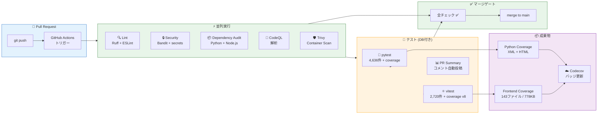
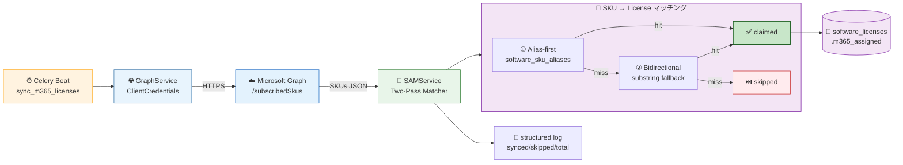
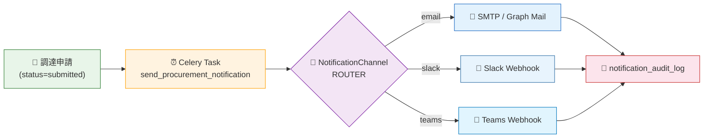
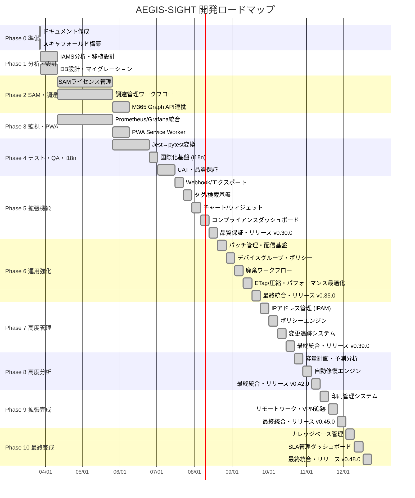
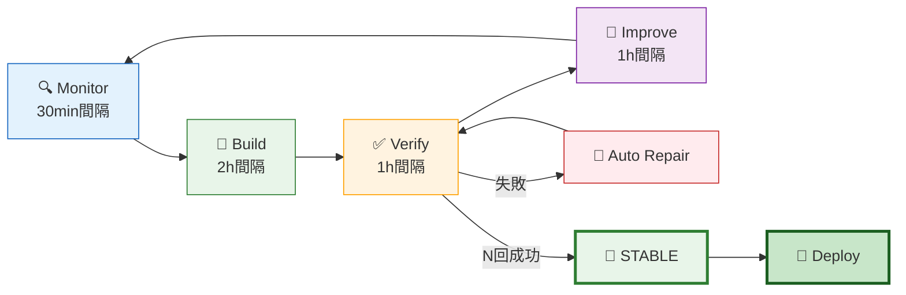

<div align="center">

```
 █████╗ ███████╗ ██████╗ ██╗███████╗      ███████╗██╗ ██████╗ ██╗  ██╗████████╗
██╔══██╗██╔════╝██╔════╝ ██║██╔════╝      ██╔════╝██║██╔════╝ ██║  ██║╚══██╔══╝
███████║█████╗  ██║  ███╗██║███████╗█████╗███████╗██║██║  ███╗███████║   ██║
██╔══██║██╔══╝  ██║   ██║██║╚════██║╚════╝╚════██║██║██║   ██║██╔══██║   ██║
██║  ██║███████╗╚██████╔╝██║███████║      ███████║██║╚██████╔╝██║  ██║   ██║
╚═╝  ╚═╝╚══════╝ ╚═════╝ ╚═╝╚══════╝      ╚══════╝╚═╝ ╚═════╝ ╚═╝  ╚═╝   ╚═╝
```

### Autonomous Endpoint Governance & Integrated Sight

**SKYSEA Client View 内製代替 + IAMS 選択移植**


[](https://github.com/Kensan196948G/AEGIS-SIGHT/actions)
[](https://github.com/Kensan196948G/AEGIS-SIGHT/actions)
[](https://codecov.io/gh/Kensan196948G/AEGIS-SIGHT)
[](https://github.com/users/Kensan196948G/projects/14)

</div>

---

## 📋 目次

- [プロジェクト期間・リリース制約](#-プロジェクト期間リリース制約最優先絶対厳守)
- [概要](#-概要)
- [主要機能](#-主要機能)
- [システムアーキテクチャ](#-システムアーキテクチャ)
- [技術スタック](#-技術スタック)
- [ディレクトリ構成](#-ディレクトリ構成)
- [開発進捗](#-開発進捗)
- [ClaudeOS 自律開発](#-claudeos-自律開発)
- [クイックスタート](#-クイックスタート)
- [ドキュメント](#-ドキュメント)
- [コンプライアンス](#-コンプライアンス)

---

## ⏰ プロジェクト期間・リリース制約（最優先・絶対厳守）

| 項目 | 値 |
|:---|:---|
| 📅 **プロジェクト期間** | **6 ヶ月**（登録日から半年） |
| 🚦 **登録日 (registered_at)** | **2026-03-25** |
| 🎯 **本番リリース期限 (release_deadline)** | **2026-09-25（絶対厳守・動かさない）** |
| ⏱️ **実行方式** | **Linux Cron** による月〜土の自動スケジュール |
| 🕔 **1 セッション最大作業時間** | **5 時間（300 分）厳守** |
| 🔄 **開発フェーズ配分** | 進捗に応じて **CTO 判断で自由変更可**（Monitor/Build/Verify/Improve の比率は動的） |

> 🛡️ **リリース期限は他のすべての方針に優先する最上位制約**。残日数が 30 日を切った時点で自動的に Improvement は縮退し、14 日以内は新機能開発を凍結する。詳細は [CLAUDE.md §1.5](./CLAUDE.md) を参照。

---

## 🎯 概要

| 項目 | 内容 |
|:---|:---|
| 🏷️ **プロジェクト名** | AEGIS-SIGHT |
| 🏢 **対象組織** | ABCDE.Inc（約550名） |
| 🖥️ **管理対象** | Windows 11/10 クライアントPC 約500台 + サーバ群 |
| 🌐 **環境** | 本社・支社・建設現場（拠点外）・テレワーク |
| 🛠️ **開発方式** | ClaudeOS v8 自律型開発（AI-Augmented Development） |
| 📊 **統合元** | IAMS (IntegratedITAssetServiceManagement) — 統合スコア 78/100 |
| 📅 **開発期間** | 全117フェーズ完了（Phase 0-117 Done）・pytest **4,648件** / vitest **2,764件**・SAM M365 Graph API 実統合 (alias-first SKU matching) ＆ 調達承認通知（email/Slack/Teams）完了・**SAM Frontend API 実接続完了 (PR#484/#485)** ・**Dashboard design 実装完了 (PR#523, 純静的 design-data 駆動)** ・**branch coverage 91.30% / functions 99.82% 達成** |

### 💡 なぜ AEGIS-SIGHT を作るのか

| 商用製品の課題 | AEGIS-SIGHT で解決 |
|:---|:---|
| 💰 ライセンスコスト継続発生 | 内製化で **70%以上コスト削減** |
| 🔒 組織固有要件への対応困難 | **完全カスタマイズ可能** |
| 🔗 Microsoft 365 との統合不足 | **Graph API でネイティブ統合** |
| 📋 J-SOX 監査証跡の不完全さ | **3年以上の証跡保全を保証** |
| 👷 IT 部門 5 名での運用限界 | **AI 自動化で工数 40%削減** |

---

## ✨ 主要機能

### 🖥️ 既存 AEGIS-SIGHT 機能

| 機能 | 説明 | 状態 |
|:---|:---|:---:|
| 📦 IT資産管理 | HW/SW情報自動収集（WMI/CIM） | ✅ Done |
| 📋 ログ管理 | ログオン/USB/ファイル操作追跡 | ✅ Done |
| 🛡️ セキュリティ監視 | Defender/BitLocker/パッチ管理 | ✅ Done |
| 📊 統合ダッシュボード | Next.js 16 リアルタイム可視化 | ✅ Done |
| 🖥️ デバイス管理画面 | デバイス一覧・詳細・フィルタ・HW情報（Phase B-5） | ✅ Done |
| 🔐 認証・RBAC | Entra ID SSO + 4ロール制御 | ✅ Done |

### 🔄 IAMS 選択移植機能

| 機能 | 説明 | 状態 |
|:---|:---|:---:|
| 📈 Prometheus/Grafana | インフラ可観測性・監視ダッシュボード | ✅ Done |
| 📱 PWA対応 | オフラインUI（建設現場対応） | ✅ Done |
| 🛒 調達管理 | 調達承認ワークフロー・ライフサイクルステッパー・**承認通知配信（email/Slack/Teams, PR#474）** | ✅ Done |
| 📦 SAMライセンス管理 | 期限追跡・月額コスト分析・**M365 Graph API 実統合（alias-first SKU matching, PR#474/#478）** | ✅ Done |
| 🧪 テスト資産変換 | **1,798件** Jest → pytest 変換 (Phase101-112完結) | ✅ Done |
| 🌐 国際化基盤 (i18n) | 日英メッセージカタログ + useTranslation hook | ✅ Done |
| 📝 Backendメッセージ | エラー/ドメインメッセージ日本語化 | ✅ Done |
| 📊 コンプライアンスダッシュボード | ISO 27001/J-SOX準拠状況可視化 | ✅ Done |
| 🔍 監査UI | 監査ログ検索・フィルタ・エクスポート | ✅ Done |
| 📄 レポートUI | 各種レポート生成・PDF/CSV出力 | ✅ Done |
| 🔧 パッチ管理 | OS/SWパッチ適用状況管理・自動配信 | ✅ Done |
| 📱 デバイスグループ | デバイスグループ管理・ポリシー適用 | ✅ Done |
| 🗑️ 廃棄ワークフロー | 資産廃棄申請・承認・証跡管理 | ✅ Done |
| ⚡ ETag/圧縮 | APIレスポンスキャッシュ・gzip圧縮最適化 | ✅ Done |
| 🌐 IPAM | IPアドレスプール管理・サブネット・VLAN | ✅ Done |
| 📜 ポリシーエンジン | ルールベースポリシー評価・違反検知 | ✅ Done |
| 🔄 変更追跡 | 構成変更自動検知・履歴管理・影響分析 | ✅ Done |
| 📈 容量計画 | リソース使用率トレンド分析・予測ダッシュボード | ✅ Done |
| 🔧 自動修復 | インシデント自動対応・修復アクション管理 | ✅ Done |
| 🖨️ 印刷管理 | プリンター資産管理・印刷ジョブ追跡・コスト集計 | ✅ Done |
| 🏠 リモートワーク | リモートワーク勤務状況ダッシュボード | ✅ Done |
| 🔐 VPN追跡 | VPN接続状況モニタリング・帯域使用率レポート | ✅ Done |
| 📚 ナレッジベース | 障害対応ナレッジ記事管理・全文検索・推薦 | ✅ Done |
| 📊 SLA管理 | SLA目標設定・達成率モニタリング・レポート | ✅ Done |

### ❌ IAMS から移植しない機能

| 機能 | 理由 |
|:---|:---|
| CMDB | AEGIS-SIGHT 本体と重複 |
| インシデント管理 | ITSM-System と重複 |
| SLA管理 | ITSM-System と重複 |
| 変更管理 | ITSM-System と重複 |

---

## 🔄 CI/CD パイプライン



---

## 🏗️ システムアーキテクチャ


### 🔗 SAM M365 ライセンス同期フロー (PR #474 / #478)



### 📣 調達承認通知フロー (PR #474)



---

## 🔧 技術スタック

| レイヤー | 技術 | バージョン |
|:---|:---|:---|
| 🐍 **Backend** | FastAPI / SQLAlchemy / Alembic / Celery | Python 3.12 |
| ⚛️ **Frontend** | Next.js / React / TypeScript / Tailwind CSS | Next.js 16 / React 19 / TS 6.0 / Tailwind 4 |
| 🐘 **Database** | PostgreSQL / Redis | PG 16 / Redis 7 |
| 💻 **Agent** | PowerShell / Pester | PS 7.4 |
| 🐳 **Infrastructure** | Docker Compose / Nginx | Docker 27 |
| 📈 **Monitoring** | Prometheus / Grafana | Latest |
| 🔄 **CI/CD** | GitHub Actions | - |
| 🔐 **Auth** | JWT (RS256) / OIDC (Entra ID) | - |

---

## 📁 ディレクトリ構成

```
📦 AEGIS-SIGHT/
├── 🐍 aegis-sight-api/           # FastAPI バックエンド (~600ファイル)
│   ├── app/api/v1/               # REST API (200+エンドポイント)
│   │   ├── auth.py               #   認証 (JWT/OAuth2)
│   │   ├── assets.py             #   IT資産管理
│   │   ├── sam.py                #   SAMライセンス管理
│   │   ├── procurement.py        #   調達管理
│   │   ├── telemetry.py          #   エージェントテレメトリ受信
│   │   ├── dashboard.py          #   ダッシュボード統計
│   │   ├── security.py           #   セキュリティ監視
│   │   ├── logs.py               #   ログ管理
│   │   ├── software.py           #   SWインベントリ
│   │   └── metrics.py            #   Prometheus メトリクス
│   ├── app/models/               # SQLAlchemy モデル (30+ テーブル, SKU alias 含む)
│   ├── app/services/             # ビジネスロジック (SAM M365 Graph API / 調達通知)
│   ├── app/tasks/                # Celery 非同期タスク (SAM日次照合 / 調達通知配信)
│   ├── app/core/                 # 設定・認証・DB・例外・メッセージ・ページネーション・ミドルウェア
│   ├── alembic/                  # DBマイグレーション (24版)
│   ├── scripts/                  # シードデータ
│   └── tests/                    # pytest (181ファイル, 4,636テスト)
│
├── ⚛️ aegis-sight-web/           # Next.js 16 フロントエンド (~220ファイル)
│   ├── app/dashboard/            # ダッシュボード (45+ページ)
│   │   ├── page.tsx              #   統計概要 (API接続, 60秒自動更新)
│   │   ├── assets/               #   IT資産一覧 (検索/フィルタ/ページネーション)
│   │   ├── sam/                  #   SAM管理 (ライセンス/コンプライアンス/レポート)
│   │   ├── procurement/          #   調達管理 (申請/詳細/ワークフロー)
│   │   ├── logs/                 #   ログ管理 (ログオン/USB/ファイル)
│   │   ├── software/             #   SWインベントリ
│   │   ├── security/             #   セキュリティ概要
│   │   ├── monitoring/           #   Grafana監視
│   │   └── settings/             #   システム設定
│   ├── app/login/                # ログインページ
│   ├── components/ui/            # UIコンポーネント (9種)
│   ├── lib/                      # APIクライアント・型定義・認証コンテキスト・i18n
│   ├── e2e/                      # Playwright E2Eテスト
│   └── public/                   # PWA manifest / Service Worker
│
├── 💻 aegis-sight-agent/         # PowerShell Agent (12ファイル)
│   ├── src/                      # 収集モジュール (HW/SW/Log/Security)
│   ├── install/                  # インストーラ
│   └── tests/                    # Pester テスト
│
├── 🏗️ aegis-sight-infra/         # インフラ設定
│   ├── observability/            # Prometheus + Grafana
│   └── nginx/                    # リバースプロキシ
│
├── 📚 docs/                      # プロジェクトドキュメント (52ファイル)
│   ├── 01_計画フェーズ/          #   プロジェクト計画・WBS・リスク管理
│   ├── 02_ロードマップ/          #   Phase1-4 詳細計画
│   ├── 03_要件定義/              #   機能/非機能要件・受入条件
│   ├── 04_アーキテクチャ設計/    #   システム・API・DB・セキュリティ
│   ├── 05_詳細設計/              #   SAM・調達・監視・PWA
│   ├── 06_開発ガイド/            #   環境構築・規約・CI/CD
│   ├── 07_テスト計画/            #   テスト戦略・変換計画
│   ├── 08_リリース管理/          #   デプロイ・ロールバック
│   ├── 09_運用管理/              #   監視・バックアップ・SLA
│   ├── 10_コンプライアンス/      #   ISO27001・J-SOX・NIST CSF
│   └── 11_IAMS廃止計画/          #   移植チェック・データ移行
│
├── 🔧 scripts/                   # ClaudeOS 自動化スクリプト
├── 🔄 .github/workflows/         # CI/CD パイプライン (claudeos-ci / frontend-ci / security-scan / deploy-prod)
├── 🐳 docker-compose.yml         # 全サービス起動
├── 🐳 docker-compose.dev.yml     # 開発用 (ホットリロード)
├── 🐳 docker-compose.test.yml    # テスト用
└── 📋 CLAUDE.md                  # ClaudeOS プロジェクト設定
```

---

## 📊 開発進捗

### フェーズ計画



### 現在のステータス

| 項目 | 状態 | 詳細 |
|:---|:---:|:---|
| 📚 ドキュメント (60+ファイル) | ✅ Done | PR #2 merged |
| 🏗️ スキャフォールド (94ファイル) | ✅ Done | PR #4 merged |
| 🐍 Backend API (10ドメイン) | ✅ Done | auth/assets/sam/procurement/telemetry/dashboard/security/logs/software/metrics |
| ⚛️ Frontend (9ページ+ログイン) | ✅ Done | 全ページAPI接続済み |
| 🧪 テスト (7,412+ケース) | ✅ Done | pytest **4,648件** + Vitest **2,764件** + Playwright E2E ・branch **91.30%** / functions **99.82%** |
| 🐳 Docker/CI最適化 | ✅ Done | マルチステージ, セキュリティスキャン, dependabot |
| 📊 GitHub Projects | ✅ Active | [司令盤 #14](https://github.com/users/Kensan196948G/projects/14) |
| 🔄 CI/CD | ✅ Passing | GitHub Actions (lint/test/build/security) + Frontend CI専用ワークフロー（paths filter）|
| 📋 監査証跡・レポート | ✅ Done | 監査API + CSV/JSONエクスポート + 通知サービス |
| 🔔 アラート・ユーザー管理 | ✅ Done | CRUD + acknowledge/resolve + ロール管理 |
| 🏢 部門・バッチ・ヘルスチェック | ✅ Done | 階層部門 + CSV一括処理 + K8s probe |
| ⚙️ 設定・ネットワーク探索 | ✅ Done | key-value設定 + MAC UPSERT + unmanaged検出 |
| ☁️ M365連携・WebSocket | ✅ Done | Graph API + リアルタイム通知 + スケジューラ |
| 🧪 統合テスト・RBAC | ✅ Done | 6シナリオ + 4ロール検証 + OpenAPI強化 |
| 🌐 国際化基盤 (i18n) | ✅ Done | Backend メッセージ日本語化 + Frontend 日英カタログ + useTranslation hook |
| 🔗 Webhook/エクスポート | ✅ Done | Webhook配信 + CSV/JSON/PDFエクスポート |
| 🏷️ タグ/検索基盤 | ✅ Done | 資産タグ管理 + 全文検索 + フィルタ強化 |
| 📊 チャート/ウィジェット | ✅ Done | ダッシュボードウィジェット + リアルタイムチャート |
| 📋 コンプライアンスダッシュボード | ✅ Done | ISO 27001/J-SOX準拠状況可視化 + 監査UI + レポートUI |
| 🔧 パッチ管理 | ✅ Done | OS/SWパッチ適用状況管理・自動配信基盤 |
| 📱 デバイスグループ | ✅ Done | デバイスグループ管理・ポリシー適用 |
| 🗑️ 廃棄ワークフロー | ✅ Done | 資産廃棄申請・承認・証跡管理 |
| ⚡ ETag/圧縮 | ✅ Done | APIレスポンスキャッシュ・gzip圧縮最適化 |
| 🌐 IP管理 (IPAM) | ✅ Done | IPアドレスプール管理・サブネット・VLAN |
| 📜 ポリシーエンジン | ✅ Done | ルールベースポリシー評価・違反検知・自動通知 |
| 🔄 変更追跡 | ✅ Done | 構成変更自動検知・履歴管理・影響分析 |
| 📈 容量計画・予測分析 | ✅ Done | リソース使用率トレンド分析・予測ダッシュボード |
| 🔧 自動修復エンジン | ✅ Done | インシデント自動対応・修復アクション管理 |
| 🖨️ 印刷管理 | ✅ Done | プリンター資産管理・印刷ジョブ追跡・コスト集計 |
| 🏠 リモートワーク・VPN追跡 | ✅ Done | VPN接続モニタリング・リモートワーク勤務状況 |
| 📚 ナレッジベース管理 | ✅ Done | 障害対応ナレッジ記事管理・全文検索・推薦 |
| 📊 SLA管理ダッシュボード | ✅ Done | SLA目標設定・達成率モニタリング・レポート |
| 🎯 最終統合 v0.48.0 | ✅ Done | 全48 Phase完了・最終リリース |
| 🚀 **Phase50 本番デプロイ準備** | ✅ **Done** | deploy-prod.yml・Grafanaアラート強化 (22ルール)・IAMSデータ移行スクリプト (PR#117 merged) |
| 🔧 **Phase51 依存関係更新・ステージング** | ✅ **Done** | Actions PR#13,#15,#17,#18 マージ済み・npm major PRリスク評価済み・ドキュメント更新 (PR#119 merged) (Issue#118) |
| 🧪 **Phase101-112 IAMS pytest移植完結** | ✅ **Done** | 累計1,798件テスト (PR#173-184) — 1,157件目標比 +641件超過達成 |
| 🖥️ **Phase113 フロントエンドPhase B-5** | ✅ **Done** | デバイス管理画面実装（一覧・詳細・サイドバー追加）(PR#185) |
| 🔧 **CI品質強化・テスト追加** | ✅ **Done** | ESLint修正・SearchPageテスト追加・Frontend CI専用ワークフロー (PR#236, #237) |
| 🐛 **Ruff lint 修正 (UP035/UP007/F401/I001)** | ✅ **Done** | alembic/app 全67件 auto-fix・Dependabot CI ブロック解除 (PR#265 merged) |
| 📦 **vitest 1→3→4 アップグレード** | ✅ **Done** | peer dep 不整合解消・全96テスト pass (1.58s)・jsdom 24→29 (PR#267/#269 merged) |
| 🤖 **Dependabot groups 設定** | ✅ **Done** | vitest/React/Next.js/build-tools グループ化・再発防止 (PR#268 merged) |
| 🔧 **GitHub Actions アップデート** | ✅ **Done** | codecov@6/docker actions v4→7/github-script@8 (PR#254-258 merged) |
| 🔒 **vite セキュリティ修正** | ✅ **Done** | vite 7.3.1→7.3.2 HIGH×4+MODERATE修正・96テスト pass (PR#276 merged) |
| 📦 **Dependabot type-tools グループ** | ✅ **Done** | typescript/eslint/@types/* グループ化 (PR#274 merged) |
| 📋 **Issue #238 移行計画詳細化** | ✅ **Done** | Step 1-6 段階移行ロードマップ策定・セキュリティ残存影響記録 |
| 🐌 **Issue #273 pytest 高速化計画** | 📋 **Backlog** | pytest-xdist 並列化 18分→5分短縮・Issue作成済み |
| 🔒 **Dependabot 2026-04-17 一括更新 (11 PR)** | ✅ **Done** | vitest/React/postcss/typescript/ClaudeOS v8/ESLint ignore (#319-#330 merged) |
| 🐛 **FastAPI Query regex→pattern 修正** | ✅ **Done** | DeprecationWarning 排除 (PR#332 merged) |
| 🔤 **Ruff UP017 datetime.UTC 統一 (116件)** | 🔄 **CI中** | `datetime.timezone.utc` → `datetime.UTC` 54ファイル (PR#334) |
| 🔤 **Ruff 残存 auto-fix 13件** | 🔄 **CI中** | RUF100/RUF005/UP038/B007 一括修正 (PR#336) |
| ⏳ **ESLint 10 移行** | 🚫 **Blocked** | eslint-plugin-react upstream 非互換・upstream 対応待ち (Issue#325) |
| 🔗 **SAM M365 Graph API 実統合** | ✅ **Done** | `SAMService.sync_m365_licenses` + procurement 通知サービス統合 (PR #474, 2026-04-23 merged) |
| 🎯 **SKU → License alias mapping** | ✅ **Done** | `software_sku_aliases` テーブル + 2-pass matcher (alias-first → substring fallback) (PR #478, 2026-04-23 merged) |

### GitHub Issues トラッカー

**🔄 アクティブ / バックログ:**

| # | タイトル | 状態 |
|:--|:---|:---:|
| [#325](https://github.com/Kensan196948G/AEGIS-SIGHT/issues/325) | ESLint 10 移行ブロック (upstream待ち) | 🚫 Blocked |
| [#238](https://github.com/Kensan196948G/AEGIS-SIGHT/issues/238) | 依存関係移行計画: Next.js 16 / Tailwind 4 / ESLint 10 | 📋 Backlog |
| [#273](https://github.com/Kensan196948G/AEGIS-SIGHT/issues/273) | pytest 高速化計画 (pytest-xdist) | 📋 Backlog |

<details>
<summary>✅ 完了済み Issues (50+ 件)</summary>

| # | タイトル | Phase |
|:--|:---|:---|
| #1 | 全ドキュメント作成 | Done |
| #3 | Phase1 スキャフォールド | Done |
| #5 | Phase2 Backend深化 | Done |
| #7-#42 | Phase3-12 各種機能実装 | Done |
| - | Phase13-48 全機能実装 (v0.48.0) | Done |
| #116 | Phase50 本番デプロイ準備 | Done |
| #118 | Phase51 依存関係更新 | Done |
| #240 | GitHub Actions Node.js 24対応 | Done |
| #264 | Ruff lint 修正 (UP035/UP007/F401/I001) | Done |
| #266 | vitest 1→4 アップグレード | Done |
| #331 | FastAPI Query regex→pattern 修正 (PR#332) | Done |
| #333 | Ruff UP017 datetime.UTC 統一 116件 (PR#334) | 🔄 CI中 |
| #335 | Ruff 残存 auto-fix RUF100/RUF005/UP038/B007 (PR#336) | 🔄 CI中 |
| #289 | React 19 hooks lint 再有効化 | Done |
| #298 | README バージョン修正 | Done |
| #300 | coverage設定・StatCardテスト | Done |
| #302 | ブランチカバレッジ87→90%テスト | Done |
| #305 | ブランチカバレッジ90%達成 | Done |
| #425 | procurement 通知サービス統合 (email/Slack/Teams) | Done (PR#474) |
| #426 | SAMサービス M365 Graph API 実統合 | Done (PR#474) |
| #477 | SAM SKU → SoftwareLicense alias mapping | Done (PR#478) |

</details>

---

## 🤖 ClaudeOS 自律開発

### 開発ループ



### 開発セッション履歴

<details>
<summary>📅 Session 1-7 (2026-03-27) — Phase 0-48 全機能実装</summary>

| Session | 内容 | Phase | PR |
|:---|:---|:---|:---:|
| Session 1 | 基盤構築 (docs 52ファイル + scaffold 94ファイル + API 10ドメイン + Frontend 9ページ) | Phase 0-25 | #2-#41 |
| Session 2 | Webhook/エクスポート・タグ管理・チャート・コンプライアンスダッシュボード | Phase 26-30 | - |
| Session 3 | パッチ管理・デバイスグループ・廃棄ワークフロー・ETag/圧縮 | Phase 31-35 | - |
| Session 4 | IPAM・ポリシーエンジン・変更追跡 | Phase 36-39 | - |
| Session 5 | 容量計画・自動修復エンジン | Phase 40-42 | - |
| Session 6 | 印刷管理・リモートワーク・VPN追跡 | Phase 43-45 | - |
| Session 7 | ナレッジベース・SLA管理ダッシュボード → **v0.48.0 リリース** | Phase 46-48 | - |

</details>

<details>
<summary>📅 Session 8 (2026-04-02) — Phase 50-100 本番準備・IAMS pytest 移植</summary>

| 時間 | 内容 | PR |
|:---|:---|:---:|
| Phase50 | 本番デプロイ準備 (Trivy修正・Prometheus 22ルール・IAMS移行スクリプト) | #117 |
| Phase51 | 依存関係更新・ステージング・npm major PRリスク評価 | #118-#120 |
| Phase52 | AlertManager Grafana統合・SAM期限アラートAPI | #122 |
| Phase53-100 | **IAMS pytest 変換 48バッチ (Phase1-48)** — 累計1,798件テスト完了 | #124-#171 |

</details>

<details>
<summary>📅 Session 9-12 (2026-04-02) — フロントエンド強化・チャート全ページ実装</summary>

| Session | 内容 | PR |
|:---|:---|:---:|
| Session 9 | Phase101-112 IAMS pytest完結 + Phase113-122 フロントエンド強化 (デバイス管理・Badge統一) | #173-#194 |
| Session 10 | Phase D-1/D-2 SAMライセンス管理強化・調達承認ワークフロー | #197-#198 |
| Session 11 | Phase D-3〜D-11 チャート可視化 (9ページ DonutChart+BarChart) | #199-#207 |
| Session 12 | Phase D-12〜D-27 残全ページチャート + E2E検証 + Systemd登録 + バグ修正 | #209-#232 |

</details>

<details>
<summary>📅 Session 13 (2026-04-08) — カバレッジ設定・テスト追加・CI強化</summary>

| 内容 | 詳細 | PR |
|:---|:---|:---:|
| フロントエンドテスト大量追加 | 75本テストファイル (1,940+テスト) | #299 ✅ |
| Backend coverage 設定 | pyproject.toml に [tool.coverage.*] セクション追加 | #301 |
| StatCard テスト実装 | ui-components.test.tsx — StatCard 包括テスト | #301 |
| useOnlineStatus hook テスト | useSyncExternalStore 多重呼出し対応テスト | #301 |
| lib/types.ts テスト実装 | 全型定義の網羅テスト (coverage 0%→~100%) | #301 |
| CI 強化 | vitest coverage artifact・Codecov 統合・PR summary 改善 | #301 |
| Codecov バッジ追加 | README にカバレッジ可視化バッジ追加 | #301 |

**実測フロントエンドカバレッジ (Session 14 Verify済):**

| メトリクス | 実績 | 閾値 | 判定 |
|:---|:---:|:---:|:---:|
| Statements | **97.08%** | 90% | ✅ |
| Branches | **90.21%** | 85% | ✅ |
| Functions | **94.56%** | 88% | ✅ |
| Lines | **96.26%** | 90% | ✅ |

</details>

<details>
<summary>📅 Session 2026-04-23 — SAM M365 Graph API 実統合 + 調達通知 + SKU alias</summary>

| 内容 | 詳細 | PR |
|:---|:---|:---:|
| SAM M365 Graph API 実統合 | `SAMService.sync_m365_licenses` (subscribedSkus→consumedUnits 同期) / 単体テスト 14件 | [#474](https://github.com/Kensan196948G/AEGIS-SIGHT/pull/474) ✅ |
| 調達承認通知サービス統合 | email / Slack / Teams チャネル経由の `send_procurement_notification` / 単体テスト 10件 | [#474](https://github.com/Kensan196948G/AEGIS-SIGHT/pull/474) ✅ |
| SKU → License alias mapping | `software_sku_aliases` テーブル + 2-pass matcher (alias-first → substring fallback) + claim exclusivity / 単体テスト 10件 | [#478](https://github.com/Kensan196948G/AEGIS-SIGHT/pull/478) ✅ |
| Issue 整理 | #425 / #426 / #477 を close、残 Open は upstream 待ちの #325 のみ | — |
| テスト数 | pytest `collected 4,636 tests` 達成 (前回比 +2,838) | — |

</details>

<details>
<summary>📅 Session 14 (2026-04-09) — ブランチカバレッジ90%達成・閾値ラチェット</summary>

| 内容 | 詳細 | PR |
|:---|:---|:---:|
| ブランチカバレッジ90%達成 | 3ソースファイルから条件分岐をexport関数化→テスト直接検証 | #306 ✅ |
| CI テスト修正 | DLP/alerts テスト修正 (getByDisplayValue→DOM query) | merged ✅ |
| カバレッジ閾値ラチェット | vitest thresholds 引き上げ (branches 75→85, statements 80→90) | #308 🔄 |
| README 大幅更新 | カバレッジ数値・バージョン整合・ダイアグラム強化 | #309 🔨 |

**フロントエンドカバレッジ改善:**

| メトリクス | Session 13 | Session 14 | 改善幅 |
|:---|:---:|:---:|:---:|
| Statements | 92.48% | **97.08%** | +4.60 |
| Branches | 85.49% | **90.21%** | +4.72 |
| Functions | 87.79% | **94.56%** | +6.77 |
| Lines | 93.55% | **96.26%** | +2.71 |

</details>

### STABLE 判定条件

| 条件 | 基準 | 現在 |
|:---|:---|:---:|
| Backend テスト | 全テスト通過 | ✅ **181 ファイル / 4,636件** pytest |
| Frontend テスト | 全テスト通過 | ✅ 92 ファイル / 2,720件 vitest |
| フロントカバレッジ | Lines ≥ 90% | ✅ **99.57%** |
| ブランチカバレッジ | Branches ≥ 85% | ✅ **91.30%** |
| 関数カバレッジ | Functions ≥ 85% | ✅ **99.82%** |
| CI | GitHub Actions 成功 | ✅ |
| Lint | ruff + ESLint エラー 0 | ✅ |
| Build | Docker build 成功 | ✅ |
| エラー | 実行時エラー 0 | ✅ |
| セキュリティ | Critical 脆弱性 0 | ✅ |

> **N = 3** (通常変更)：✅ STABLE — Session 2026-05-01 全チェック通過 (PR#503/#507 merged, PR#508 open, pytest 4,636 / vitest 2,720 / functions 99.82% / branches 91.30%)

### Agent Teams

| 役割 | 責務 |
|:---|:---|
| 🧠 **CTO** | 優先順位判断、5時間制御、最終判断 |
| 📋 **ProductManager** | Issue 生成、要件整理 |
| 📐 **Architect** | アーキテクチャ設計、責務分離 |
| 💻 **Developer** | 実装、修正、修復 |
| 👀 **Reviewer** | Codex レビュー、コード品質、保守性確認 |
| 🔍 **Debugger** | 原因分析、Codex rescue 実行 |
| 🧪 **QA** | テスト、回帰確認、品質評価 |
| 🔐 **Security** | secrets、権限、脆弱性確認 |
| 🚀 **DevOps** | CI/CD、PR、Projects制御 |
| 📊 **Analyst** | KPI 分析、メトリクス評価 |
| 🔄 **EvolutionManager** | 改善提案、自己進化管理 |
| 📦 **ReleaseManager** | リリース管理、マージ判断 |

---

## 🚀 クイックスタート

### 1. 環境変数の設定

```bash
# リポジトリクローン
git clone https://github.com/Kensan196948G/AEGIS-SIGHT.git
cd AEGIS-SIGHT

# 環境変数テンプレートをコピー
cp .env.example .env
```

`.env` を編集し、以下の主要項目を設定してください：

| 変数 | 説明 | デフォルト |
|:---|:---|:---|
| `POSTGRES_USER` | DB ユーザー名 | `aegis` |
| `POSTGRES_PASSWORD` | DB パスワード | `aegis_dev` (**本番では変更必須**) |
| `SECRET_KEY` | JWT 署名キー | (**必ず変更**: `openssl rand -hex 32`) |
| `NEXT_PUBLIC_API_URL` | フロントエンド→API 接続先 | `http://localhost:8000` |
| `CORS_ORIGINS` | CORS 許可オリジン | `["http://localhost:3000"]` |
| `GRAFANA_ADMIN_PASSWORD` | Grafana 管理パスワード | `admin` |

> 📋 全項目は [`.env.example`](./.env.example) を参照

### 2. サービス起動

```bash
# 全サービス起動 (本番)
docker compose up -d

# 開発モード (ホットリロード)
docker compose -f docker-compose.yml -f docker-compose.dev.yml up -d

# テスト実行
docker compose -f docker-compose.test.yml up --abort-on-container-exit
```

### 3. アクセス先

| サービス | URL |
|:---|:---|
| 🌐 Web UI | http://localhost:3000 |
| 🐍 API | http://localhost:8000 |
| 📖 API Docs (Swagger) | http://localhost:8000/docs |
| 📉 Grafana | http://localhost:3001 |
| 📈 Prometheus | http://localhost:9090 |

---

## 📚 ドキュメント

全52ファイル以上の詳細ドキュメントは [docs/](./docs/) フォルダに配置:

### 🗺️ 6ヶ月開発フェーズ計画（2026-03-25〜2026-09-25・本番リリース絶対厳守）

> 🛡️ 本番リリース日 `release_deadline` は **2026-09-25** が最上位制約（[CLAUDE.md §1.5](./CLAUDE.md)）。各 Phase の終了日はこの絶対期限を超えないこと。

| フェーズ | 名称 | 期間 | 状態 |
|---------|------|------|------|
| **Phase A** | 🏗️ 基盤構築 | 〜2026-04-21 | ✅ 完了 |
| **Phase B** | ⚙️ コア機能実装 | 〜2026-05-31 | ✅ 完了 (B-5 デバイス管理まで) |
| **Phase C** | 🔄 IAMS選択移植 | 〜2026-06-30 | ✅ 完了 (1,798件 pytest 移植完結) |
| **Phase D** | 📊 監視・チャート統合 | 〜2026-07-31 | ✅ 完了 (D-1〜D-27 全チャート実装) |
| **Phase E** | 🛡️ QA・セキュリティ・品質強化 | 〜2026-08-31 | 🔄 進行中 (Coverage 90%+達成) |
| **Phase F** | 🚀 リリース準備 | 〜2026-09-25 | ⏳ 未開始 |

> 📋 詳細: [docs/development-phases/](./docs/development-phases/)

### 📁 ドキュメント一覧

| # | カテゴリ | ファイル数 | 内容 |
|:--|:---|:---:|:---|
| 🗺️ | [開発フェーズ計画](./docs/development-phases/) | 7 | **Phase A〜F 6ヶ月計画（新設）** |
| 01 | [計画フェーズ](./docs/01_計画フェーズ（Planning）/) | 5 | プロジェクト計画、WBS、リスク管理 |
| 02 | [ロードマップ](./docs/02_ロードマップ（Roadmap）/) | 5 | Phase A-F 詳細計画（6ヶ月版）|
| 03 | [要件定義](./docs/03_要件定義（Requirements）/) | 4 | 機能/非機能要件、受入条件 |
| 04 | [アーキテクチャ](./docs/04_アーキテクチャ設計（Architecture）/) | 6 | システム・API・DB・セキュリティ |
| 05 | [詳細設計](./docs/05_詳細設計（Detailed-Design）/) | 5 | SAM・調達・監視・PWA |
| 06 | [開発ガイド](./docs/06_開発ガイド（Development-Guide）/) | 5 | 環境構築・規約・CI/CD |
| 07 | [テスト計画](./docs/07_テスト計画（Testing）/) | 5 | テスト戦略・変換計画 |
| 08 | [リリース管理](./docs/08_リリース管理（Release-Management）/) | 5 | デプロイ・ロールバック |
| 09 | [運用管理](./docs/09_運用管理（Operations）/) | 5 | 監視・バックアップ・SLA |
| 10 | [コンプライアンス](./docs/10_コンプライアンス（Compliance）/) | 4 | ISO27001・J-SOX・NIST CSF |
| 11 | [IAMS廃止](./docs/11_IAMS廃止計画（IAMS-Decommission）/) | 3 | 移植チェック・データ移行 |

---

## 🔒 コンプライアンス

| 規格 | 対応範囲 |
|:---|:---|
| **ISO 27001:2022** | A.5.9 資産目録 / A.5.14 情報転送 / A.8.8 脆弱性管理 |
| **ISO 20000-1:2018** | IT資産ライフサイクル管理 |
| **NIST CSF 2.0** | IDENTIFY (ID.AM) 資産管理 |
| **J-SOX** | IT全般統制 / ライセンス管理証跡 / 7年保存 |

---

## 📜 開発ルール

- `main` への直接 push 禁止
- feature branch または Git WorkTree で開発
- PR 必須、CI 通過必須（lint / test / build / security）
- テストカバレッジ: Statements **98.82%**, Branches **91.30%**, Functions **99.82%**, Lines **99.57%**
- ClaudeOS 自律開発ループによる継続的品質改善

## 🛡️ セキュリティヘッダー

フロントエンドは以下の HTTP セキュリティヘッダーを全レスポンスに付与しています：

| ヘッダー | 値 | 目的 |
|:---|:---|:---|
| `Content-Security-Policy` | frame-ancestors/form-action/object-src 制限 | XSS・クリックジャッキング防止 |
| `X-Frame-Options` | `DENY` | フレーム埋め込み禁止 |
| `X-Content-Type-Options` | `nosniff` | MIME スニッフィング防止 |
| `Referrer-Policy` | `strict-origin-when-cross-origin` | リファラー情報最小化 |
| `Permissions-Policy` | camera/mic/geolocation 無効 | 不要 API 権限を制限 |

### Next.js 16 proxy.ts 移行

Next.js 16 にて `middleware.ts` が `proxy.ts` に改名 (PR#507)。auth クッキーによる Server-side ルート保護は継続。

---

<div align="center">

**🏗️ みらい建設工業 IT部門 | AEGIS-SIGHT | 2026**

*Built with [ClaudeOS v8](./CLAUDE.md) Autonomous Development*

</div>
