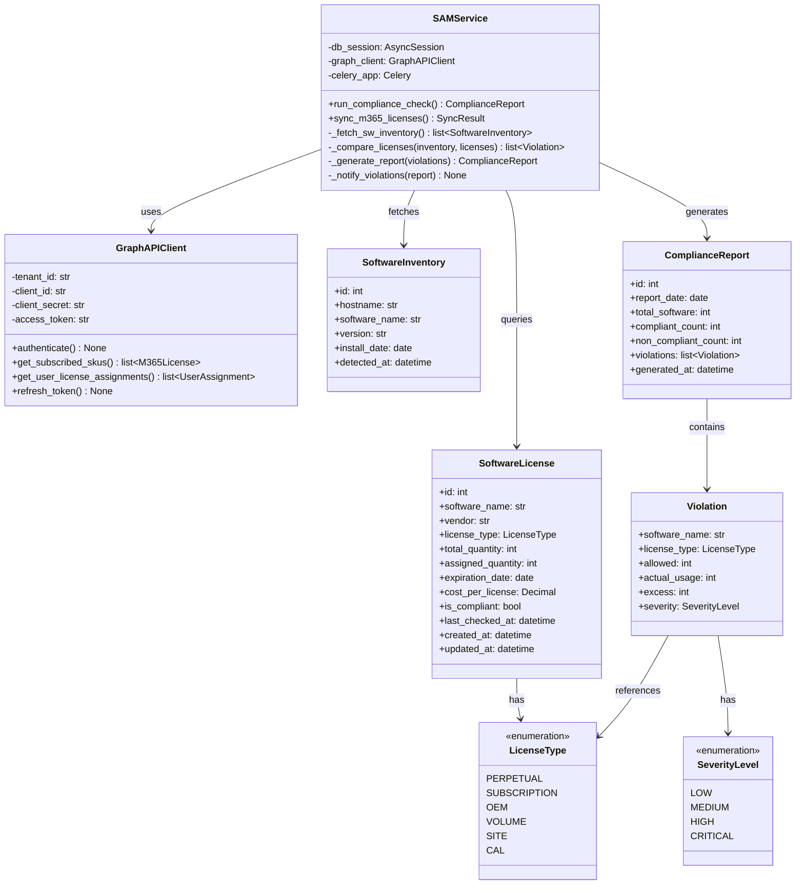
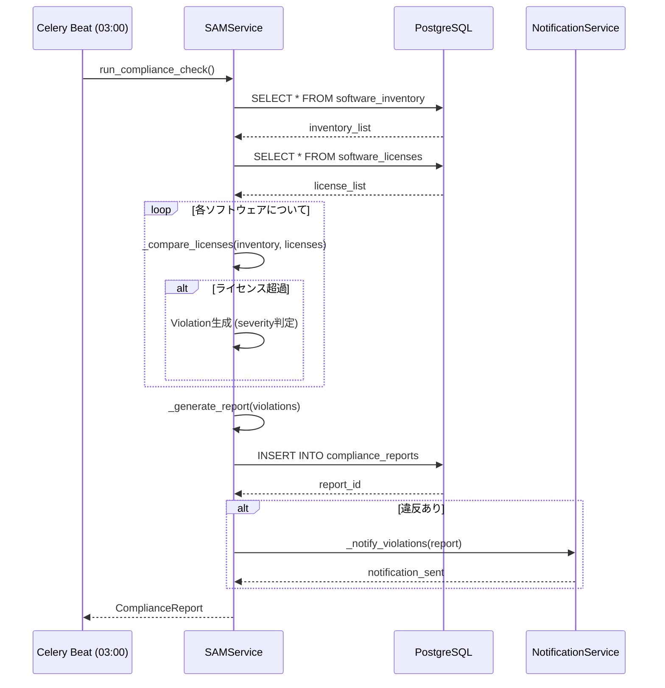
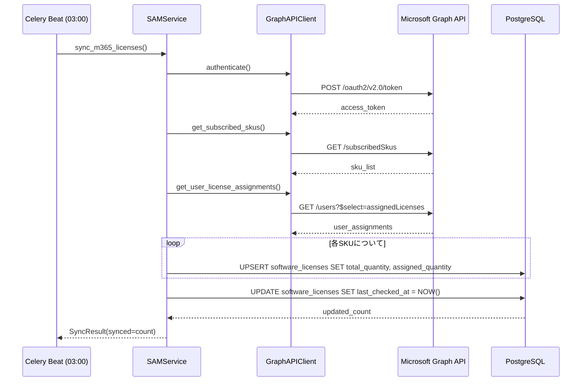
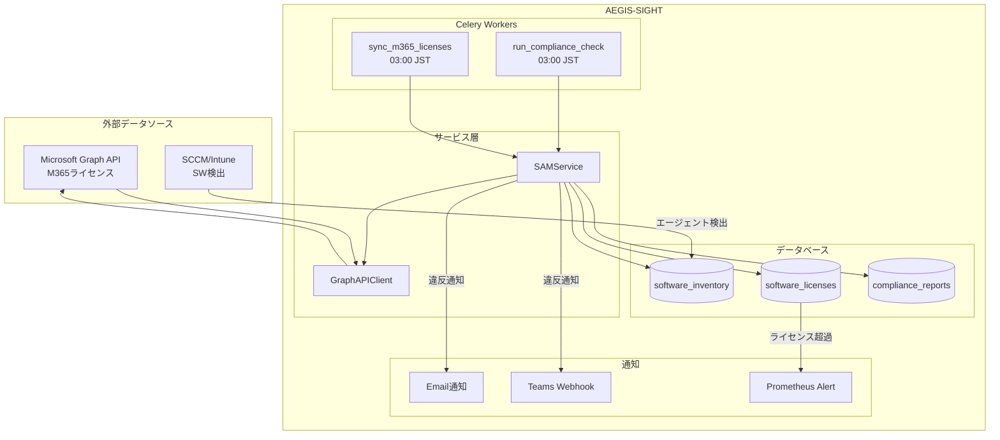

# SAMライセンス管理 詳細設計（SAM License Design）

## 1. 概要

Software Asset Management（SAM）ライセンス管理モジュールは、組織内のソフトウェアインベントリとライセンスのコンプライアンスチェック、およびMicrosoft 365ライセンスのGraph API経由同期を担う。Celeryによる日次バッチ（03:00 JST）で自動実行される。

---

## 2. クラス図



---

## 3. シーケンス図

### 3.1 コンプライアンスチェック



### 3.2 M365ライセンス同期



---

## 4. API仕様

### 4.1 コンプライアンスレポート取得

| 項目 | 値 |
|---|---|
| **エンドポイント** | `GET /api/v1/sam/compliance/reports` |
| **認証** | Bearer Token (JWT) |
| **権限** | `sam:read` |

**クエリパラメータ:**

| パラメータ | 型 | 必須 | 説明 |
|---|---|---|---|
| `date_from` | string (ISO 8601) | No | レポート開始日 |
| `date_to` | string (ISO 8601) | No | レポート終了日 |
| `page` | int | No | ページ番号（デフォルト: 1） |
| `per_page` | int | No | 1ページあたり件数（デフォルト: 20） |

**レスポンス (200):**

```json
{
  "data": [
    {
      "id": 42,
      "report_date": "2026-03-27",
      "total_software": 150,
      "compliant_count": 145,
      "non_compliant_count": 5,
      "violations": [
        {
          "software_name": "Adobe Acrobat Pro",
          "license_type": "SUBSCRIPTION",
          "allowed": 50,
          "actual_usage": 58,
          "excess": 8,
          "severity": "HIGH"
        }
      ],
      "generated_at": "2026-03-27T03:15:00+09:00"
    }
  ],
  "pagination": {
    "page": 1,
    "per_page": 20,
    "total": 1
  }
}
```

### 4.2 手動コンプライアンスチェック実行

| 項目 | 値 |
|---|---|
| **エンドポイント** | `POST /api/v1/sam/compliance/check` |
| **認証** | Bearer Token (JWT) |
| **権限** | `sam:execute` |

**レスポンス (202):**

```json
{
  "task_id": "a1b2c3d4-e5f6-7890-abcd-ef1234567890",
  "status": "queued",
  "message": "コンプライアンスチェックをキューに投入しました"
}
```

### 4.3 M365ライセンス手動同期

| 項目 | 値 |
|---|---|
| **エンドポイント** | `POST /api/v1/sam/m365/sync` |
| **認証** | Bearer Token (JWT) |
| **権限** | `sam:execute` |

**レスポンス (202):**

```json
{
  "task_id": "b2c3d4e5-f6a7-8901-bcde-f12345678901",
  "status": "queued",
  "message": "M365ライセンス同期をキューに投入しました"
}
```

### 4.4 ライセンス一覧取得

| 項目 | 値 |
|---|---|
| **エンドポイント** | `GET /api/v1/sam/licenses` |
| **認証** | Bearer Token (JWT) |
| **権限** | `sam:read` |

**クエリパラメータ:**

| パラメータ | 型 | 必須 | 説明 |
|---|---|---|---|
| `vendor` | string | No | ベンダー名フィルタ |
| `is_compliant` | bool | No | コンプライアンス状態フィルタ |
| `license_type` | string | No | ライセンス種別フィルタ |

**レスポンス (200):**

```json
{
  "data": [
    {
      "id": 1,
      "software_name": "Microsoft 365 E3",
      "vendor": "Microsoft",
      "license_type": "SUBSCRIPTION",
      "total_quantity": 500,
      "assigned_quantity": 487,
      "expiration_date": "2027-03-31",
      "cost_per_license": "3960.00",
      "is_compliant": true,
      "last_checked_at": "2026-03-27T03:00:00+09:00"
    }
  ],
  "pagination": {
    "page": 1,
    "per_page": 20,
    "total": 85
  }
}
```

---

## 5. データフロー



---

## 6. データベース設計

### 6.1 software_licenses テーブル

```sql
CREATE TABLE software_licenses (
    id              SERIAL PRIMARY KEY,
    software_name   VARCHAR(255) NOT NULL,
    vendor          VARCHAR(255) NOT NULL,
    license_type    VARCHAR(50) NOT NULL DEFAULT 'SUBSCRIPTION',
    license_key     VARCHAR(512),
    total_quantity  INTEGER NOT NULL DEFAULT 0,
    assigned_quantity INTEGER NOT NULL DEFAULT 0,
    expiration_date DATE,
    cost_per_license NUMERIC(12, 2),
    is_compliant    BOOLEAN NOT NULL DEFAULT TRUE,
    last_checked_at TIMESTAMPTZ,
    m365_sku_id     VARCHAR(128),
    created_at      TIMESTAMPTZ NOT NULL DEFAULT NOW(),
    updated_at      TIMESTAMPTZ NOT NULL DEFAULT NOW(),

    CONSTRAINT chk_quantity CHECK (assigned_quantity >= 0 AND total_quantity >= 0),
    CONSTRAINT uq_software_vendor UNIQUE (software_name, vendor, license_type)
);

CREATE INDEX idx_sl_vendor ON software_licenses (vendor);
CREATE INDEX idx_sl_compliant ON software_licenses (is_compliant);
CREATE INDEX idx_sl_expiration ON software_licenses (expiration_date);
CREATE INDEX idx_sl_m365_sku ON software_licenses (m365_sku_id) WHERE m365_sku_id IS NOT NULL;
```

### 6.2 software_inventory テーブル

```sql
CREATE TABLE software_inventory (
    id              SERIAL PRIMARY KEY,
    hostname        VARCHAR(255) NOT NULL,
    software_name   VARCHAR(255) NOT NULL,
    version         VARCHAR(100),
    install_date    DATE,
    detected_at     TIMESTAMPTZ NOT NULL DEFAULT NOW(),
    source          VARCHAR(50) NOT NULL DEFAULT 'SCCM',

    CONSTRAINT uq_host_software UNIQUE (hostname, software_name, version)
);

CREATE INDEX idx_si_software ON software_inventory (software_name);
CREATE INDEX idx_si_hostname ON software_inventory (hostname);
```

### 6.3 compliance_reports テーブル

```sql
CREATE TABLE compliance_reports (
    id              SERIAL PRIMARY KEY,
    report_date     DATE NOT NULL,
    total_software  INTEGER NOT NULL DEFAULT 0,
    compliant_count INTEGER NOT NULL DEFAULT 0,
    non_compliant_count INTEGER NOT NULL DEFAULT 0,
    violations_json JSONB NOT NULL DEFAULT '[]',
    generated_at    TIMESTAMPTZ NOT NULL DEFAULT NOW()
);

CREATE INDEX idx_cr_date ON compliance_reports (report_date DESC);
```

---

## 7. Celeryタスク設定

```python
# app/tasks/sam_tasks.py
from celery import shared_task
from celery.schedules import crontab

@shared_task(
    bind=True,
    name="sam.run_compliance_check",
    max_retries=3,
    default_retry_delay=300,  # 5分後にリトライ
    soft_time_limit=1800,     # 30分でソフトリミット
    time_limit=2400,          # 40分でハードリミット
)
def run_compliance_check_task(self):
    """日次コンプライアンスチェック"""
    try:
        service = SAMService()
        report = service.run_compliance_check()
        return {"report_id": report.id, "violations": report.non_compliant_count}
    except Exception as exc:
        self.retry(exc=exc)


@shared_task(
    bind=True,
    name="sam.sync_m365_licenses",
    max_retries=3,
    default_retry_delay=300,
)
def sync_m365_licenses_task(self):
    """M365ライセンス同期"""
    try:
        service = SAMService()
        result = service.sync_m365_licenses()
        return {"synced": result.synced_count, "errors": result.error_count}
    except Exception as exc:
        self.retry(exc=exc)


# Celery Beat スケジュール設定
CELERY_BEAT_SCHEDULE = {
    "sam-compliance-check-daily": {
        "task": "sam.run_compliance_check",
        "schedule": crontab(hour=3, minute=0),  # 毎日 03:00 JST
        "options": {"queue": "sam"},
    },
    "sam-m365-sync-daily": {
        "task": "sam.sync_m365_licenses",
        "schedule": crontab(hour=3, minute=0),  # 毎日 03:00 JST
        "options": {"queue": "sam"},
    },
}
```

---

## 8. Graph API連携設定

```python
# app/services/graph_client.py
import httpx
from app.core.config import settings

class GraphAPIClient:
    BASE_URL = "https://graph.microsoft.com/v1.0"
    TOKEN_URL = "https://login.microsoftonline.com/{tenant_id}/oauth2/v2.0/token"

    def __init__(self):
        self.tenant_id = settings.AZURE_TENANT_ID
        self.client_id = settings.AZURE_CLIENT_ID
        self.client_secret = settings.AZURE_CLIENT_SECRET
        self.access_token: str | None = None

    async def authenticate(self) -> None:
        """OAuth2 Client Credentials フローでトークン取得"""
        url = self.TOKEN_URL.format(tenant_id=self.tenant_id)
        data = {
            "grant_type": "client_credentials",
            "client_id": self.client_id,
            "client_secret": self.client_secret,
            "scope": "https://graph.microsoft.com/.default",
        }
        async with httpx.AsyncClient() as client:
            resp = await client.post(url, data=data)
            resp.raise_for_status()
            self.access_token = resp.json()["access_token"]

    async def get_subscribed_skus(self) -> list[dict]:
        """M365 サブスクリプションSKU一覧取得"""
        headers = {"Authorization": f"Bearer {self.access_token}"}
        async with httpx.AsyncClient() as client:
            resp = await client.get(f"{self.BASE_URL}/subscribedSkus", headers=headers)
            resp.raise_for_status()
            return resp.json().get("value", [])

    async def get_user_license_assignments(self) -> list[dict]:
        """ユーザーごとのライセンス割り当て取得"""
        headers = {"Authorization": f"Bearer {self.access_token}"}
        users = []
        url = f"{self.BASE_URL}/users?$select=id,displayName,assignedLicenses&$top=999"
        async with httpx.AsyncClient() as client:
            while url:
                resp = await client.get(url, headers=headers)
                resp.raise_for_status()
                data = resp.json()
                users.extend(data.get("value", []))
                url = data.get("@odata.nextLink")
        return users
```

---

## 9. 環境変数

| 変数名 | 説明 | 例 |
|---|---|---|
| `AZURE_TENANT_ID` | Azure ADテナントID | `xxxxxxxx-xxxx-xxxx-xxxx-xxxxxxxxxxxx` |
| `AZURE_CLIENT_ID` | アプリケーション(クライアント)ID | `yyyyyyyy-yyyy-yyyy-yyyy-yyyyyyyyyyyy` |
| `AZURE_CLIENT_SECRET` | クライアントシークレット | `***` |
| `CELERY_BROKER_URL` | Celery Broker接続先 | `redis://localhost:6379/0` |
| `SAM_COMPLIANCE_NOTIFY_EMAIL` | 違反通知先メール | `it-admin@example.co.jp` |
| `SAM_TEAMS_WEBHOOK_URL` | Teams通知Webhook URL | `https://outlook.office.com/webhook/...` |

---

## 10. エラーハンドリング

| エラー種別 | 対処 | リトライ |
|---|---|---|
| Graph API認証失敗 | シークレット有効期限確認、管理者通知 | 最大3回（5分間隔） |
| Graph APIレート制限 (429) | Retry-Afterヘッダに従い待機 | 自動リトライ |
| DB接続タイムアウト | コネクションプール確認 | 最大3回（5分間隔） |
| ライセンスデータ不整合 | ログ出力、手動確認フラグ設定 | なし |
| Celeryタスクタイムアウト | SoftTimeLimitExceeded例外捕捉、部分結果保存 | なし |
