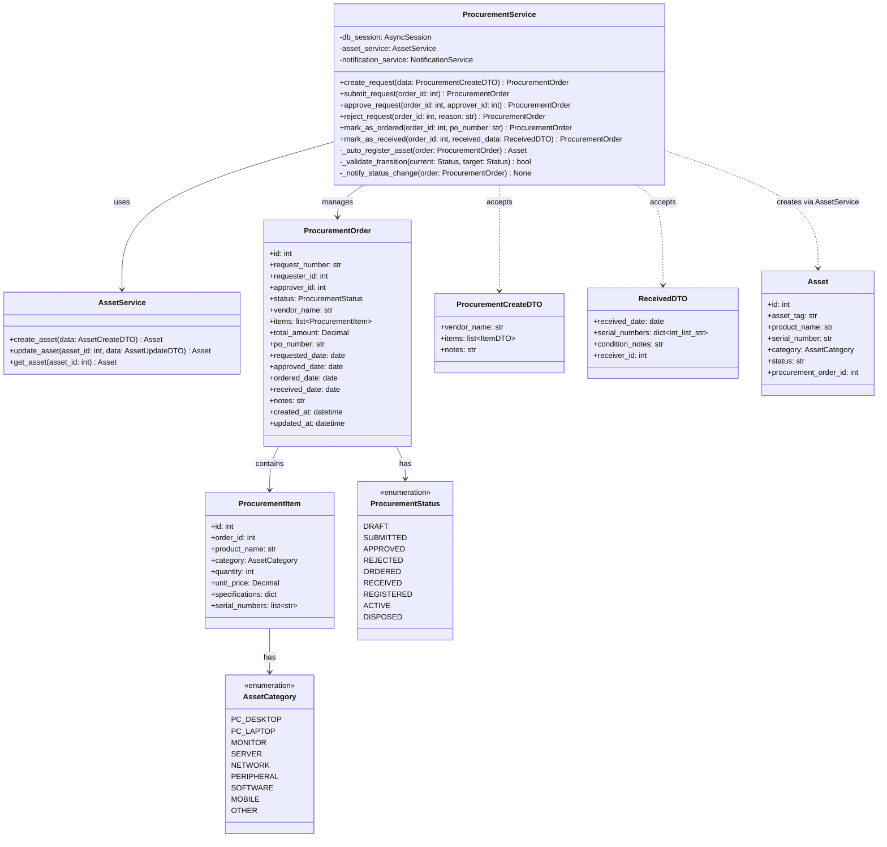
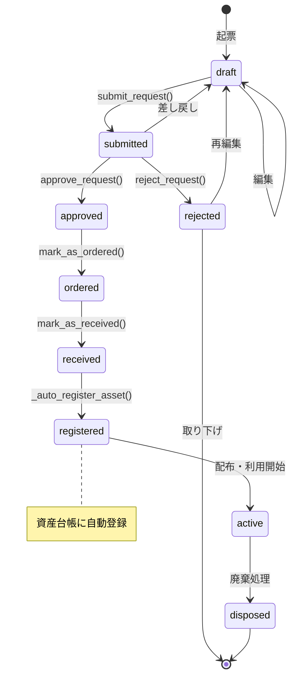
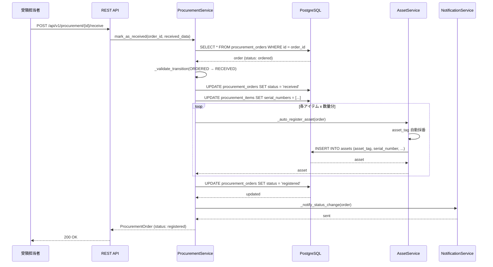
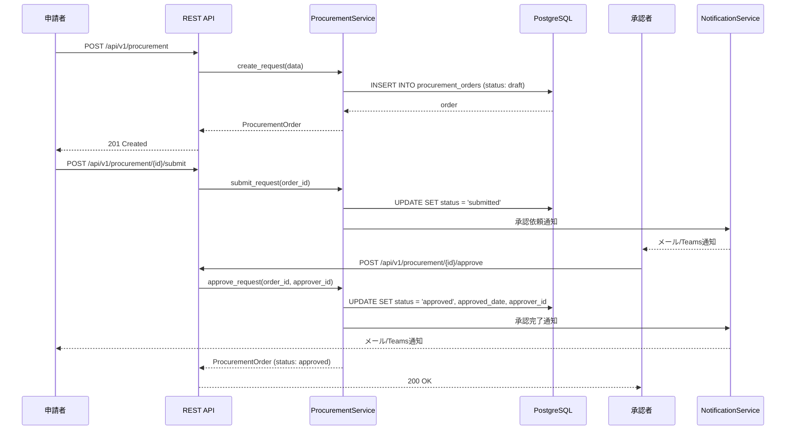
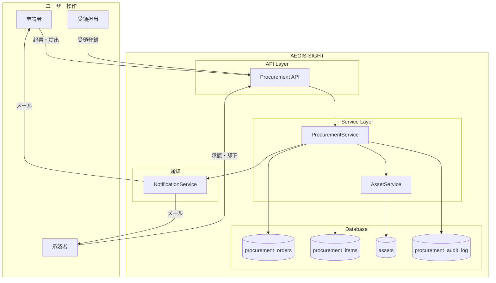

# 調達管理 詳細設計（Procurement Design）

## 1. 概要

調達管理モジュールは、IT資産の調達プロセスをライフサイクル全体にわたって管理する。調達申請の起票から受領、資産台帳への自動登録までをカバーし、`ProcurementService`がビジネスロジックの中核を担う。

**ステータス遷移:**
`draft` → `submitted` → `approved` → `ordered` → `received` → `registered` → `active` → `disposed`

---

## 2. クラス図



---

## 3. ステータス遷移図



---

## 4. シーケンス図

### 4.1 受領 → 資産台帳自動登録フロー



### 4.2 調達申請 → 承認フロー



---

## 5. API仕様

### 5.1 調達申請作成

| 項目 | 値 |
|---|---|
| **エンドポイント** | `POST /api/v1/procurement` |
| **認証** | Bearer Token (JWT) |
| **権限** | `procurement:create` |

**リクエストボディ:**

```json
{
  "vendor_name": "Dell Technologies",
  "items": [
    {
      "product_name": "Dell Latitude 5550",
      "category": "PC_LAPTOP",
      "quantity": 10,
      "unit_price": 185000,
      "specifications": {
        "cpu": "Intel Core Ultra 7",
        "memory": "32GB",
        "storage": "512GB NVMe"
      }
    }
  ],
  "notes": "2026年度新入社員用"
}
```

**レスポンス (201):**

```json
{
  "id": 101,
  "request_number": "PR-2026-0101",
  "status": "draft",
  "vendor_name": "Dell Technologies",
  "items": [...],
  "total_amount": "1850000.00",
  "created_at": "2026-03-27T10:00:00+09:00"
}
```

### 5.2 受領処理

| 項目 | 値 |
|---|---|
| **エンドポイント** | `POST /api/v1/procurement/{id}/receive` |
| **認証** | Bearer Token (JWT) |
| **権限** | `procurement:receive` |

**リクエストボディ:**

```json
{
  "received_date": "2026-04-10",
  "serial_numbers": {
    "1": ["DELL-SN-001", "DELL-SN-002", "DELL-SN-003"]
  },
  "condition_notes": "全数検品完了。外装破損なし。",
  "receiver_id": 42
}
```

**レスポンス (200):**

```json
{
  "id": 101,
  "request_number": "PR-2026-0101",
  "status": "registered",
  "received_date": "2026-04-10",
  "registered_assets": [
    {
      "asset_tag": "AST-2026-04-0001",
      "serial_number": "DELL-SN-001",
      "product_name": "Dell Latitude 5550"
    }
  ]
}
```

### 5.3 ステータス変更API一覧

| エンドポイント | メソッド | 権限 | 遷移 |
|---|---|---|---|
| `/api/v1/procurement/{id}/submit` | POST | `procurement:create` | draft → submitted |
| `/api/v1/procurement/{id}/approve` | POST | `procurement:approve` | submitted → approved |
| `/api/v1/procurement/{id}/reject` | POST | `procurement:approve` | submitted → rejected |
| `/api/v1/procurement/{id}/order` | POST | `procurement:order` | approved → ordered |
| `/api/v1/procurement/{id}/receive` | POST | `procurement:receive` | ordered → received → registered |
| `/api/v1/procurement/{id}/activate` | POST | `procurement:manage` | registered → active |
| `/api/v1/procurement/{id}/dispose` | POST | `procurement:manage` | active → disposed |

### 5.4 調達一覧取得

| 項目 | 値 |
|---|---|
| **エンドポイント** | `GET /api/v1/procurement` |
| **認証** | Bearer Token (JWT) |
| **権限** | `procurement:read` |

**クエリパラメータ:**

| パラメータ | 型 | 必須 | 説明 |
|---|---|---|---|
| `status` | string | No | ステータスフィルタ |
| `vendor_name` | string | No | ベンダー名部分一致 |
| `date_from` | string | No | 申請日From |
| `date_to` | string | No | 申請日To |
| `page` | int | No | ページ番号 |
| `per_page` | int | No | 1ページあたり件数 |

---

## 6. データフロー



---

## 7. データベース設計

### 7.1 procurement_orders テーブル

```sql
CREATE TABLE procurement_orders (
    id              SERIAL PRIMARY KEY,
    request_number  VARCHAR(20) NOT NULL UNIQUE,
    requester_id    INTEGER NOT NULL REFERENCES users(id),
    approver_id     INTEGER REFERENCES users(id),
    status          VARCHAR(20) NOT NULL DEFAULT 'draft',
    vendor_name     VARCHAR(255) NOT NULL,
    total_amount    NUMERIC(14, 2) NOT NULL DEFAULT 0,
    po_number       VARCHAR(50),
    requested_date  DATE,
    approved_date   DATE,
    ordered_date    DATE,
    received_date   DATE,
    notes           TEXT,
    created_at      TIMESTAMPTZ NOT NULL DEFAULT NOW(),
    updated_at      TIMESTAMPTZ NOT NULL DEFAULT NOW(),

    CONSTRAINT chk_status CHECK (
        status IN ('draft','submitted','approved','rejected',
                   'ordered','received','registered','active','disposed')
    )
);

CREATE INDEX idx_po_status ON procurement_orders (status);
CREATE INDEX idx_po_requester ON procurement_orders (requester_id);
CREATE INDEX idx_po_vendor ON procurement_orders (vendor_name);
```

### 7.2 procurement_items テーブル

```sql
CREATE TABLE procurement_items (
    id              SERIAL PRIMARY KEY,
    order_id        INTEGER NOT NULL REFERENCES procurement_orders(id) ON DELETE CASCADE,
    product_name    VARCHAR(255) NOT NULL,
    category        VARCHAR(50) NOT NULL,
    quantity        INTEGER NOT NULL DEFAULT 1,
    unit_price      NUMERIC(12, 2) NOT NULL,
    specifications  JSONB DEFAULT '{}',
    serial_numbers  JSONB DEFAULT '[]',
    created_at      TIMESTAMPTZ NOT NULL DEFAULT NOW(),

    CONSTRAINT chk_quantity_positive CHECK (quantity > 0),
    CONSTRAINT chk_price_positive CHECK (unit_price >= 0)
);

CREATE INDEX idx_pi_order ON procurement_items (order_id);
```

### 7.3 procurement_audit_log テーブル

```sql
CREATE TABLE procurement_audit_log (
    id              SERIAL PRIMARY KEY,
    order_id        INTEGER NOT NULL REFERENCES procurement_orders(id),
    action          VARCHAR(50) NOT NULL,
    from_status     VARCHAR(20),
    to_status       VARCHAR(20),
    performed_by    INTEGER NOT NULL REFERENCES users(id),
    details         JSONB DEFAULT '{}',
    performed_at    TIMESTAMPTZ NOT NULL DEFAULT NOW()
);

CREATE INDEX idx_pal_order ON procurement_audit_log (order_id);
CREATE INDEX idx_pal_date ON procurement_audit_log (performed_at DESC);
```

---

## 8. ステータス遷移バリデーション

```python
# app/services/procurement_service.py

VALID_TRANSITIONS: dict[str, list[str]] = {
    "draft":      ["submitted"],
    "submitted":  ["approved", "rejected", "draft"],
    "approved":   ["ordered"],
    "rejected":   ["draft"],
    "ordered":    ["received"],
    "received":   ["registered"],
    "registered": ["active"],
    "active":     ["disposed"],
    "disposed":   [],
}

class ProcurementService:
    def _validate_transition(self, current: str, target: str) -> bool:
        """ステータス遷移の妥当性を検証"""
        allowed = VALID_TRANSITIONS.get(current, [])
        if target not in allowed:
            raise InvalidTransitionError(
                f"遷移不可: {current} → {target} "
                f"(許可: {allowed})"
            )
        return True

    async def mark_as_received(
        self, order_id: int, received_data: ReceivedDTO
    ) -> ProcurementOrder:
        """受領処理 → 資産台帳自動登録"""
        order = await self._get_order(order_id)
        self._validate_transition(order.status, "received")

        # ステータス更新: received
        order.status = "received"
        order.received_date = received_data.received_date

        # シリアル番号をアイテムに紐付け
        for item_id_str, serials in received_data.serial_numbers.items():
            item = await self._get_item(int(item_id_str))
            item.serial_numbers = serials

        # 資産台帳への自動登録
        registered_assets = await self._auto_register_asset(order)

        # ステータス更新: registered
        order.status = "registered"

        # 監査ログ記録
        await self._audit_log(order, "received_and_registered", received_data.receiver_id)

        # 通知
        await self._notify_status_change(order)

        await self.db_session.commit()
        return order

    async def _auto_register_asset(self, order: ProcurementOrder) -> list:
        """受領済みアイテムから資産を自動登録"""
        assets = []
        for item in order.items:
            for serial in item.serial_numbers:
                asset = await self.asset_service.create_asset(
                    AssetCreateDTO(
                        product_name=item.product_name,
                        serial_number=serial,
                        category=item.category,
                        procurement_order_id=order.id,
                        status="registered",
                    )
                )
                assets.append(asset)
        return assets
```

---

## 9. エラーハンドリング

| エラー | HTTPステータス | 対処 |
|---|---|---|
| `InvalidTransitionError` | 409 Conflict | 不正なステータス遷移を拒否 |
| `OrderNotFoundError` | 404 Not Found | 指定IDの注文が存在しない |
| `DuplicateSerialNumberError` | 422 Unprocessable Entity | シリアル番号重複 |
| `InsufficientPermissionError` | 403 Forbidden | 権限不足 |
| `ApprovalRequiredError` | 422 Unprocessable Entity | 承認者未設定のまま承認操作 |
