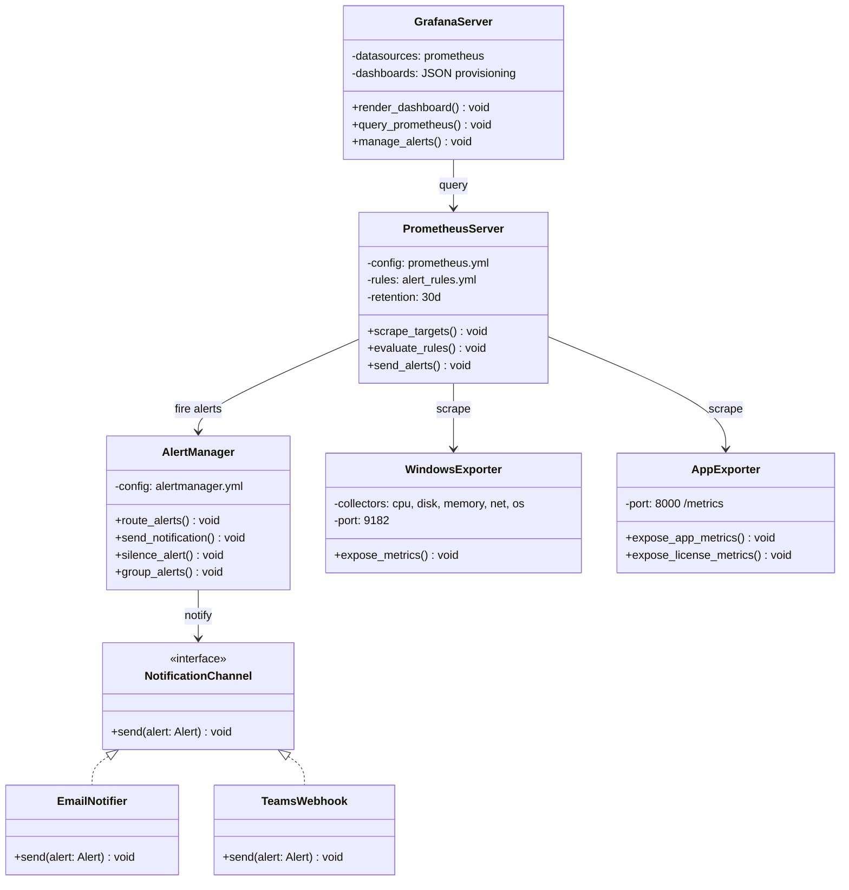
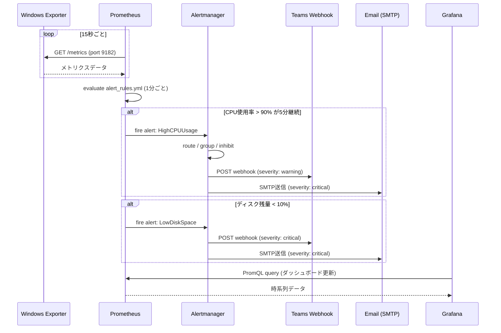
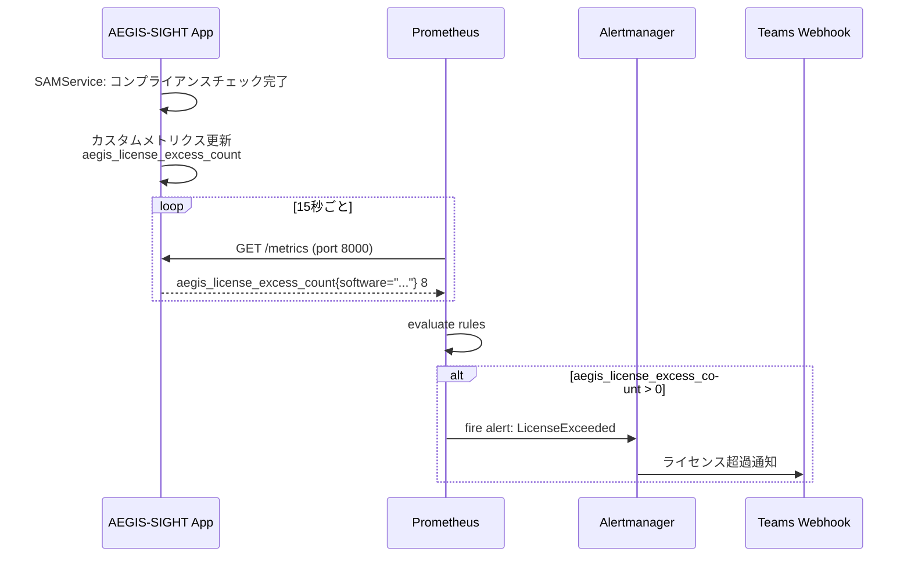
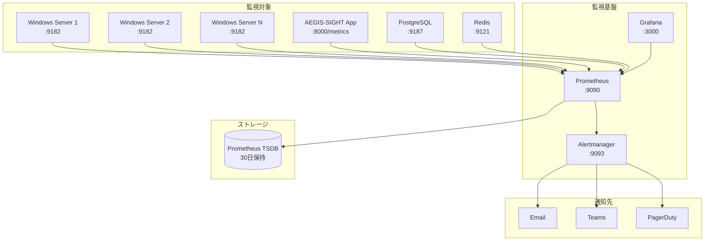

# Prometheus / Grafana 監視設計（Observability Design）

## 1. 概要

AEGIS-SIGHTの可観測性基盤として、Prometheus によるメトリクス収集と Grafana によるダッシュボード可視化を構築する。Windows Exporter によるホストメトリクス収集、およびアプリケーション固有のカスタムメトリクスを対象とし、CPU使用率90%超・ディスク残量10%未満・ライセンス超過の3種のアラートルールを定義する。

---

## 2. アーキテクチャ図



---

## 3. シーケンス図

### 3.1 アラート発火フロー



### 3.2 ライセンス超過アラートフロー



---

## 4. データフロー



---

## 5. 設定ファイル

### 5.1 prometheus.yml

```yaml
global:
  scrape_interval: 15s
  evaluation_interval: 1m
  scrape_timeout: 10s

  external_labels:
    environment: "production"
    project: "aegis-sight"

rule_files:
  - "rules/alert_rules.yml"

alerting:
  alertmanagers:
    - static_configs:
        - targets:
            - "alertmanager:9093"

scrape_configs:
  # AEGIS-SIGHT アプリケーション
  - job_name: "aegis-sight-app"
    metrics_path: "/metrics"
    scrape_interval: 15s
    static_configs:
      - targets:
          - "app-server-01:8000"
          - "app-server-02:8000"
        labels:
          service: "aegis-sight"
          tier: "application"

  # Windows Exporter
  - job_name: "windows-exporter"
    scrape_interval: 15s
    static_configs:
      - targets:
          - "win-srv-01:9182"
          - "win-srv-02:9182"
          - "win-srv-03:9182"
          - "win-dc-01:9182"
          - "win-dc-02:9182"
        labels:
          service: "windows"
          tier: "infrastructure"

  # PostgreSQL Exporter
  - job_name: "postgres-exporter"
    scrape_interval: 30s
    static_configs:
      - targets:
          - "db-server-01:9187"
        labels:
          service: "postgresql"
          tier: "database"

  # Redis Exporter
  - job_name: "redis-exporter"
    scrape_interval: 15s
    static_configs:
      - targets:
          - "redis-server-01:9121"
        labels:
          service: "redis"
          tier: "cache"

  # Prometheus 自身
  - job_name: "prometheus"
    static_configs:
      - targets:
          - "localhost:9090"
```

### 5.2 alert_rules.yml

```yaml
groups:
  - name: infrastructure_alerts
    interval: 1m
    rules:
      # CPU使用率 90% 超過アラート
      - alert: HighCPUUsage
        expr: >
          100 - (avg by (instance) (
            rate(windows_cpu_time_total{mode="idle"}[5m])
          ) * 100) > 90
        for: 5m
        labels:
          severity: warning
          team: infrastructure
        annotations:
          summary: "CPU使用率が90%を超過 ({{ $labels.instance }})"
          description: >
            ホスト {{ $labels.instance }} のCPU使用率が
            {{ printf "%.1f" $value }}% に達しています。
            5分以上継続中。即座に確認してください。
          runbook_url: "https://wiki.example.co.jp/runbook/high-cpu"

      # ディスク残量 10% 未満アラート
      - alert: LowDiskSpace
        expr: >
          (windows_logical_disk_free_bytes{volume!~"HarddiskVolume.*"}
          / windows_logical_disk_size_bytes{volume!~"HarddiskVolume.*"})
          * 100 < 10
        for: 5m
        labels:
          severity: critical
          team: infrastructure
        annotations:
          summary: "ディスク空き容量が10%未満 ({{ $labels.instance }}:{{ $labels.volume }})"
          description: >
            ホスト {{ $labels.instance }} のボリューム {{ $labels.volume }} の
            空き容量が {{ printf "%.1f" $value }}% です。
            早急にディスク容量を確保してください。
          runbook_url: "https://wiki.example.co.jp/runbook/low-disk"

  - name: application_alerts
    interval: 1m
    rules:
      # ライセンス超過アラート
      - alert: LicenseExceeded
        expr: aegis_license_excess_count > 0
        for: 0m
        labels:
          severity: warning
          team: sam
        annotations:
          summary: "ライセンス超過検出 ({{ $labels.software_name }})"
          description: >
            ソフトウェア {{ $labels.software_name }} のライセンスが
            {{ $value }} 件超過しています。
            コンプライアンス違反の可能性があります。
          runbook_url: "https://wiki.example.co.jp/runbook/license-exceeded"

      # アプリケーション高レイテンシ
      - alert: HighResponseLatency
        expr: >
          histogram_quantile(0.95,
            sum(rate(http_request_duration_seconds_bucket[5m])) by (le, handler)
          ) > 2
        for: 5m
        labels:
          severity: warning
          team: application
        annotations:
          summary: "API応答時間が2秒超過 ({{ $labels.handler }})"
          description: >
            エンドポイント {{ $labels.handler }} の95パーセンタイル応答時間が
            {{ printf "%.2f" $value }}秒 に達しています。

      # アプリケーション高エラーレート
      - alert: HighErrorRate
        expr: >
          sum(rate(http_requests_total{status=~"5.."}[5m])) by (handler)
          / sum(rate(http_requests_total[5m])) by (handler)
          * 100 > 5
        for: 5m
        labels:
          severity: critical
          team: application
        annotations:
          summary: "エラーレートが5%超過 ({{ $labels.handler }})"
```

### 5.3 alertmanager.yml

```yaml
global:
  resolve_timeout: 5m
  smtp_from: "prometheus@example.co.jp"
  smtp_smarthost: "smtp.example.co.jp:587"
  smtp_auth_username: "prometheus@example.co.jp"
  smtp_auth_password_file: "/etc/alertmanager/smtp_password"
  smtp_require_tls: true

templates:
  - "/etc/alertmanager/templates/*.tmpl"

route:
  receiver: "default"
  group_by: ["alertname", "team"]
  group_wait: 30s
  group_interval: 5m
  repeat_interval: 4h
  routes:
    - match:
        severity: critical
      receiver: "critical-alerts"
      group_wait: 10s
      repeat_interval: 1h
    - match:
        team: sam
      receiver: "sam-team"
    - match:
        team: infrastructure
      receiver: "infra-team"

receivers:
  - name: "default"
    webhook_configs:
      - url: "https://outlook.office.com/webhook/default-channel"
        send_resolved: true

  - name: "critical-alerts"
    email_configs:
      - to: "it-critical@example.co.jp"
        send_resolved: true
    webhook_configs:
      - url: "https://outlook.office.com/webhook/critical-channel"
        send_resolved: true

  - name: "sam-team"
    webhook_configs:
      - url: "https://outlook.office.com/webhook/sam-channel"
        send_resolved: true
    email_configs:
      - to: "sam-team@example.co.jp"
        send_resolved: true

  - name: "infra-team"
    webhook_configs:
      - url: "https://outlook.office.com/webhook/infra-channel"
        send_resolved: true
    email_configs:
      - to: "infra-team@example.co.jp"
        send_resolved: true

inhibit_rules:
  - source_match:
      severity: "critical"
    target_match:
      severity: "warning"
    equal: ["alertname", "instance"]
```

---

## 6. Windows Exporter 設定

### 6.1 インストール・設定

```powershell
# Windows Exporter インストール (MSI)
msiexec /i windows_exporter-0.25.1-amd64.msi `
  ENABLED_COLLECTORS="cpu,cs,logical_disk,memory,net,os,process,service,system,textfile" `
  LISTEN_PORT="9182" `
  /qn

# Windows Firewallルール追加
New-NetFirewallRule `
  -DisplayName "Windows Exporter" `
  -Direction Inbound `
  -Protocol TCP `
  -LocalPort 9182 `
  -Action Allow
```

### 6.2 収集メトリクス一覧

| コレクタ | 主要メトリクス | 用途 |
|---|---|---|
| `cpu` | `windows_cpu_time_total` | CPU使用率計算 |
| `logical_disk` | `windows_logical_disk_free_bytes` | ディスク空き容量 |
| `logical_disk` | `windows_logical_disk_size_bytes` | ディスク総容量 |
| `memory` | `windows_os_physical_memory_free_bytes` | メモリ空き容量 |
| `net` | `windows_net_bytes_total` | ネットワークスループット |
| `os` | `windows_os_info` | OS情報 |
| `service` | `windows_service_state` | Windowsサービス状態 |
| `system` | `windows_system_system_up_time` | アップタイム |

---

## 7. アプリケーションカスタムメトリクス

```python
# app/metrics.py
from prometheus_client import Counter, Histogram, Gauge, Info

# HTTPリクエストメトリクス
http_requests_total = Counter(
    "http_requests_total",
    "Total HTTP requests",
    labelnames=["method", "handler", "status"],
)

http_request_duration_seconds = Histogram(
    "http_request_duration_seconds",
    "HTTP request duration in seconds",
    labelnames=["method", "handler"],
    buckets=[0.01, 0.05, 0.1, 0.25, 0.5, 1.0, 2.0, 5.0, 10.0],
)

# SAMライセンスメトリクス
aegis_license_total = Gauge(
    "aegis_license_total",
    "Total license count by software",
    labelnames=["software_name", "vendor", "license_type"],
)

aegis_license_assigned = Gauge(
    "aegis_license_assigned",
    "Assigned license count by software",
    labelnames=["software_name", "vendor", "license_type"],
)

aegis_license_excess_count = Gauge(
    "aegis_license_excess_count",
    "License excess count (assigned - total, if positive)",
    labelnames=["software_name", "vendor"],
)

# 調達メトリクス
aegis_procurement_orders_total = Counter(
    "aegis_procurement_orders_total",
    "Total procurement orders created",
    labelnames=["status"],
)

# アプリケーション情報
aegis_app_info = Info(
    "aegis_app",
    "AEGIS-SIGHT application information",
)
```

---

## 8. Grafanaダッシュボード設定

### 8.1 データソースプロビジョニング

```yaml
# grafana/provisioning/datasources/prometheus.yml
apiVersion: 1
datasources:
  - name: Prometheus
    type: prometheus
    access: proxy
    url: http://prometheus:9090
    isDefault: true
    editable: false
    jsonData:
      timeInterval: "15s"
      httpMethod: POST
```

### 8.2 主要ダッシュボード

| ダッシュボード名 | 対象 | 主要パネル |
|---|---|---|
| Infrastructure Overview | Windows Server群 | CPU/メモリ/ディスク/ネットワーク |
| AEGIS-SIGHT Application | アプリケーション | リクエスト数/レイテンシ/エラーレート |
| SAM License Status | ライセンス | 総数/使用数/超過数/コンプライアンス率 |
| Database Performance | PostgreSQL | 接続数/クエリ時間/キャッシュヒット率 |
| Alert History | 全体 | アラート発火履歴/MTTR |

### 8.3 主要PromQLクエリ例

```promql
# CPU使用率（Windows）
100 - (avg by (instance) (rate(windows_cpu_time_total{mode="idle"}[5m])) * 100)

# ディスク使用率
100 - (windows_logical_disk_free_bytes / windows_logical_disk_size_bytes * 100)

# メモリ使用率
100 - (windows_os_physical_memory_free_bytes / windows_cs_physical_memory_bytes * 100)

# ライセンス超過数の合計
sum(aegis_license_excess_count > 0)

# APIリクエストレート（毎秒）
sum(rate(http_requests_total[5m])) by (handler)

# 95パーセンタイルレイテンシ
histogram_quantile(0.95, sum(rate(http_request_duration_seconds_bucket[5m])) by (le, handler))
```

---

## 9. API仕様（Grafana / Prometheus 操作）

### 9.1 アラート状態取得

| 項目 | 値 |
|---|---|
| **エンドポイント** | `GET /api/v1/monitoring/alerts` |
| **認証** | Bearer Token (JWT) |
| **権限** | `monitoring:read` |

**レスポンス (200):**

```json
{
  "data": {
    "active_alerts": [
      {
        "alert_name": "HighCPUUsage",
        "instance": "win-srv-01:9182",
        "severity": "warning",
        "value": 94.2,
        "started_at": "2026-03-27T14:30:00+09:00",
        "annotations": {
          "summary": "CPU使用率が90%を超過 (win-srv-01:9182)"
        }
      }
    ],
    "total_active": 1,
    "total_resolved_24h": 3
  }
}
```

### 9.2 メトリクスサマリ取得

| 項目 | 値 |
|---|---|
| **エンドポイント** | `GET /api/v1/monitoring/summary` |
| **認証** | Bearer Token (JWT) |
| **権限** | `monitoring:read` |

**レスポンス (200):**

```json
{
  "data": {
    "infrastructure": {
      "total_hosts": 15,
      "hosts_up": 14,
      "hosts_down": 1,
      "avg_cpu_usage": 45.3,
      "avg_memory_usage": 62.1,
      "disk_warnings": 2
    },
    "application": {
      "request_rate_per_sec": 125.4,
      "error_rate_percent": 0.12,
      "p95_latency_ms": 340
    },
    "licenses": {
      "total_monitored": 85,
      "compliant": 82,
      "exceeded": 3
    }
  }
}
```

---

## 10. Docker Compose 構成

```yaml
# docker-compose.monitoring.yml
version: "3.8"

services:
  prometheus:
    image: prom/prometheus:v2.51.0
    container_name: aegis-prometheus
    ports:
      - "9090:9090"
    volumes:
      - ./monitoring/prometheus/prometheus.yml:/etc/prometheus/prometheus.yml
      - ./monitoring/prometheus/rules:/etc/prometheus/rules
      - prometheus_data:/prometheus
    command:
      - "--config.file=/etc/prometheus/prometheus.yml"
      - "--storage.tsdb.retention.time=30d"
      - "--web.enable-lifecycle"
    restart: unless-stopped

  alertmanager:
    image: prom/alertmanager:v0.27.0
    container_name: aegis-alertmanager
    ports:
      - "9093:9093"
    volumes:
      - ./monitoring/alertmanager/alertmanager.yml:/etc/alertmanager/alertmanager.yml
      - ./monitoring/alertmanager/templates:/etc/alertmanager/templates
    restart: unless-stopped

  grafana:
    image: grafana/grafana:10.4.0
    container_name: aegis-grafana
    ports:
      - "3000:3000"
    environment:
      - GF_SECURITY_ADMIN_PASSWORD__FILE=/run/secrets/grafana_admin_password
      - GF_USERS_ALLOW_SIGN_UP=false
    volumes:
      - ./monitoring/grafana/provisioning:/etc/grafana/provisioning
      - ./monitoring/grafana/dashboards:/var/lib/grafana/dashboards
      - grafana_data:/var/lib/grafana
    depends_on:
      - prometheus
    restart: unless-stopped

volumes:
  prometheus_data:
  grafana_data:
```
