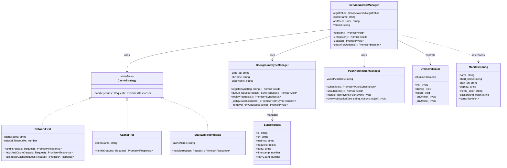
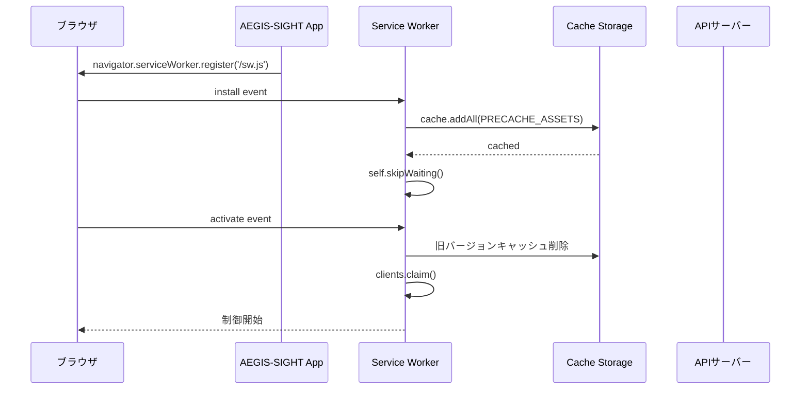
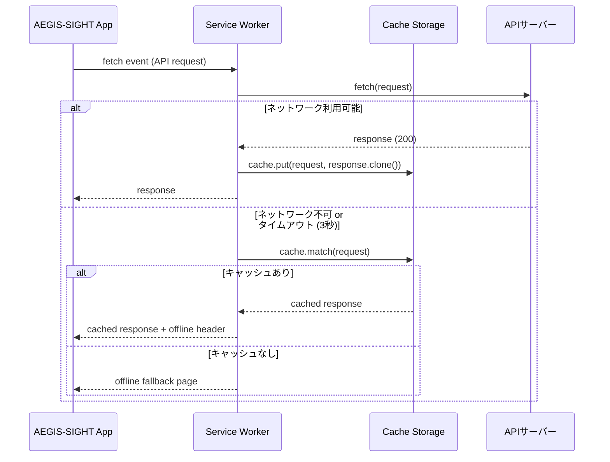
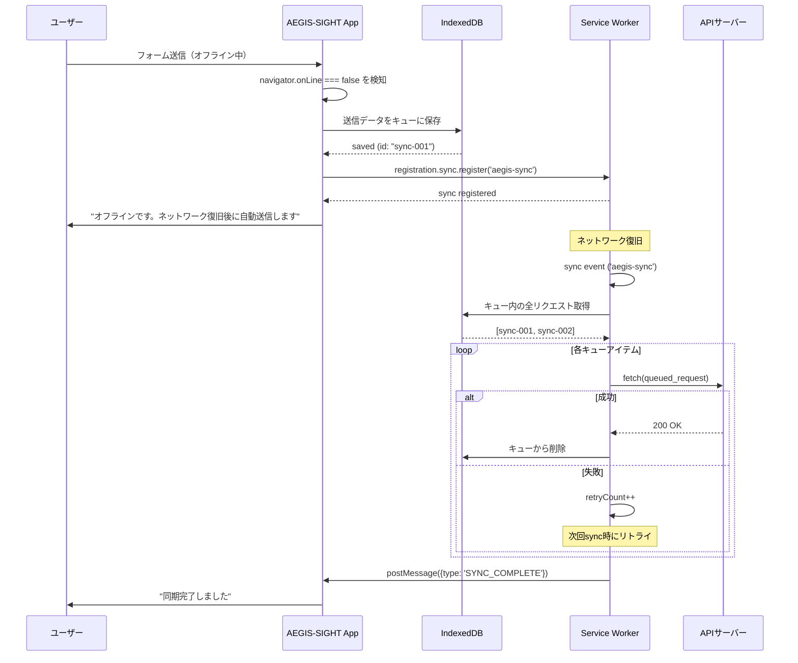
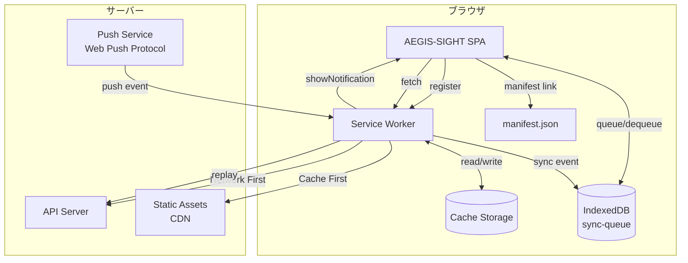

# PWA設計（PWA Design）

## 1. 概要

AEGIS-SIGHTのフロントエンドをProgressive Web App（PWA）として構築し、オフライン対応・バックグラウンド同期・プッシュ通知を実現する。Service WorkerはNetwork First戦略を採用し、ネットワーク利用可能時は常に最新データを取得しつつ、オフライン時にはキャッシュからフォールバックする。Background Sync APIにより、オフライン時の操作をネットワーク復旧後に自動同期する。

---

## 2. クラス図



---

## 3. シーケンス図

### 3.1 Service Worker ライフサイクル



### 3.2 Network First フェッチ戦略



### 3.3 Background Sync フロー



---

## 4. データフロー



---

## 5. 設定ファイル

### 5.1 manifest.json

```json
{
  "name": "AEGIS-SIGHT IT資産管理システム",
  "short_name": "AEGIS-SIGHT",
  "description": "IT資産のライフサイクル管理・監視・コンプライアンスを統合管理",
  "start_url": "/",
  "display": "standalone",
  "orientation": "any",
  "theme_color": "#1a56db",
  "background_color": "#f9fafb",
  "dir": "ltr",
  "lang": "ja",
  "categories": ["business", "productivity"],
  "icons": [
    {
      "src": "/icons/icon-72x72.png",
      "sizes": "72x72",
      "type": "image/png"
    },
    {
      "src": "/icons/icon-96x96.png",
      "sizes": "96x96",
      "type": "image/png"
    },
    {
      "src": "/icons/icon-128x128.png",
      "sizes": "128x128",
      "type": "image/png"
    },
    {
      "src": "/icons/icon-144x144.png",
      "sizes": "144x144",
      "type": "image/png"
    },
    {
      "src": "/icons/icon-152x152.png",
      "sizes": "152x152",
      "type": "image/png"
    },
    {
      "src": "/icons/icon-192x192.png",
      "sizes": "192x192",
      "type": "image/png",
      "purpose": "any maskable"
    },
    {
      "src": "/icons/icon-384x384.png",
      "sizes": "384x384",
      "type": "image/png"
    },
    {
      "src": "/icons/icon-512x512.png",
      "sizes": "512x512",
      "type": "image/png",
      "purpose": "any maskable"
    }
  ],
  "screenshots": [
    {
      "src": "/screenshots/dashboard.png",
      "sizes": "1280x720",
      "type": "image/png",
      "form_factor": "wide",
      "label": "ダッシュボード画面"
    },
    {
      "src": "/screenshots/mobile-assets.png",
      "sizes": "390x844",
      "type": "image/png",
      "form_factor": "narrow",
      "label": "資産一覧（モバイル）"
    }
  ],
  "shortcuts": [
    {
      "name": "資産検索",
      "short_name": "検索",
      "url": "/assets/search",
      "icons": [{ "src": "/icons/search-96x96.png", "sizes": "96x96" }]
    },
    {
      "name": "アラート",
      "short_name": "アラート",
      "url": "/alerts",
      "icons": [{ "src": "/icons/alert-96x96.png", "sizes": "96x96" }]
    }
  ]
}
```

### 5.2 Service Worker（sw.js）

```javascript
// sw.js - AEGIS-SIGHT Service Worker
const CACHE_VERSION = 'v1.0.0';
const STATIC_CACHE = `aegis-static-${CACHE_VERSION}`;
const API_CACHE = `aegis-api-${CACHE_VERSION}`;
const NETWORK_TIMEOUT_MS = 3000;

// プリキャッシュ対象（ビルド時に自動生成）
const PRECACHE_ASSETS = [
  '/',
  '/index.html',
  '/offline.html',
  '/manifest.json',
  '/assets/main.js',
  '/assets/main.css',
  '/icons/icon-192x192.png',
  '/icons/icon-512x512.png',
];

// ===== Install =====
self.addEventListener('install', (event) => {
  event.waitUntil(
    caches.open(STATIC_CACHE).then((cache) => {
      console.log('[SW] Precaching static assets');
      return cache.addAll(PRECACHE_ASSETS);
    })
  );
  self.skipWaiting();
});

// ===== Activate =====
self.addEventListener('activate', (event) => {
  event.waitUntil(
    caches.keys().then((cacheNames) => {
      return Promise.all(
        cacheNames
          .filter((name) => name !== STATIC_CACHE && name !== API_CACHE)
          .map((name) => {
            console.log(`[SW] Deleting old cache: ${name}`);
            return caches.delete(name);
          })
      );
    })
  );
  self.clients.claim();
});

// ===== Fetch (Network First Strategy) =====
self.addEventListener('fetch', (event) => {
  const { request } = event;
  const url = new URL(request.url);

  // API リクエスト → Network First
  if (url.pathname.startsWith('/api/')) {
    event.respondWith(networkFirst(request, API_CACHE));
    return;
  }

  // 静的アセット → Cache First
  if (
    request.destination === 'style' ||
    request.destination === 'script' ||
    request.destination === 'image' ||
    request.destination === 'font'
  ) {
    event.respondWith(cacheFirst(request, STATIC_CACHE));
    return;
  }

  // ナビゲーション → Network First
  if (request.mode === 'navigate') {
    event.respondWith(networkFirst(request, STATIC_CACHE));
    return;
  }

  // デフォルト → Network First
  event.respondWith(networkFirst(request, API_CACHE));
});

/**
 * Network First 戦略
 * ネットワークを優先し、失敗時にキャッシュへフォールバック
 */
async function networkFirst(request, cacheName) {
  try {
    const networkPromise = fetch(request);
    const timeoutPromise = new Promise((_, reject) =>
      setTimeout(() => reject(new Error('Network timeout')), NETWORK_TIMEOUT_MS)
    );

    const response = await Promise.race([networkPromise, timeoutPromise]);

    if (response.ok) {
      const cache = await caches.open(cacheName);
      cache.put(request, response.clone());
    }
    return response;
  } catch (error) {
    console.log(`[SW] Network failed, falling back to cache: ${request.url}`);
    const cachedResponse = await caches.match(request);
    if (cachedResponse) {
      return cachedResponse;
    }
    // ナビゲーションリクエストならオフラインページを返す
    if (request.mode === 'navigate') {
      return caches.match('/offline.html');
    }
    return new Response('Offline', { status: 503 });
  }
}

/**
 * Cache First 戦略
 * キャッシュを優先し、なければネットワークから取得
 */
async function cacheFirst(request, cacheName) {
  const cachedResponse = await caches.match(request);
  if (cachedResponse) {
    return cachedResponse;
  }
  try {
    const response = await fetch(request);
    if (response.ok) {
      const cache = await caches.open(cacheName);
      cache.put(request, response.clone());
    }
    return response;
  } catch {
    return new Response('Offline', { status: 503 });
  }
}

// ===== Background Sync =====
self.addEventListener('sync', (event) => {
  if (event.tag === 'aegis-sync') {
    event.waitUntil(replayQueuedRequests());
  }
});

async function replayQueuedRequests() {
  const db = await openSyncDB();
  const tx = db.transaction('sync-queue', 'readonly');
  const store = tx.objectStore('sync-queue');
  const requests = await getAllFromStore(store);

  for (const item of requests) {
    try {
      const response = await fetch(item.url, {
        method: item.method,
        headers: item.headers,
        body: item.body,
      });

      if (response.ok) {
        await removeFromQueue(db, item.id);
        // 同期成功をクライアントに通知
        const clients = await self.clients.matchAll();
        clients.forEach((client) => {
          client.postMessage({
            type: 'SYNC_ITEM_COMPLETE',
            id: item.id,
            url: item.url,
          });
        });
      }
    } catch (error) {
      console.error(`[SW] Sync failed for ${item.url}:`, error);
      // リトライカウント更新
      await updateRetryCount(db, item.id, item.retryCount + 1);
    }
  }

  // 全完了通知
  const clients = await self.clients.matchAll();
  clients.forEach((client) => {
    client.postMessage({ type: 'SYNC_COMPLETE' });
  });
}

// ===== Push Notification =====
self.addEventListener('push', (event) => {
  const data = event.data ? event.data.json() : {};
  const title = data.title || 'AEGIS-SIGHT 通知';
  const options = {
    body: data.body || '',
    icon: '/icons/icon-192x192.png',
    badge: '/icons/badge-72x72.png',
    tag: data.tag || 'default',
    data: { url: data.url || '/' },
    actions: data.actions || [],
    vibrate: [200, 100, 200],
  };

  event.waitUntil(self.registration.showNotification(title, options));
});

self.addEventListener('notificationclick', (event) => {
  event.notification.close();
  const url = event.notification.data.url;
  event.waitUntil(
    self.clients.matchAll({ type: 'window' }).then((clients) => {
      // 既存タブがあればフォーカス
      for (const client of clients) {
        if (client.url === url && 'focus' in client) {
          return client.focus();
        }
      }
      // なければ新規タブで開く
      return self.clients.openWindow(url);
    })
  );
});

// ===== IndexedDB Helpers =====
function openSyncDB() {
  return new Promise((resolve, reject) => {
    const req = indexedDB.open('aegis-sync-db', 1);
    req.onupgradeneeded = (e) => {
      const db = e.target.result;
      if (!db.objectStoreNames.contains('sync-queue')) {
        db.createObjectStore('sync-queue', { keyPath: 'id' });
      }
    };
    req.onsuccess = () => resolve(req.result);
    req.onerror = () => reject(req.error);
  });
}

function getAllFromStore(store) {
  return new Promise((resolve, reject) => {
    const req = store.getAll();
    req.onsuccess = () => resolve(req.result);
    req.onerror = () => reject(req.error);
  });
}

async function removeFromQueue(db, id) {
  const tx = db.transaction('sync-queue', 'readwrite');
  tx.objectStore('sync-queue').delete(id);
  return new Promise((resolve) => { tx.oncomplete = resolve; });
}

async function updateRetryCount(db, id, count) {
  const tx = db.transaction('sync-queue', 'readwrite');
  const store = tx.objectStore('sync-queue');
  const item = await new Promise((resolve) => {
    const req = store.get(id);
    req.onsuccess = () => resolve(req.result);
  });
  if (item) {
    item.retryCount = count;
    store.put(item);
  }
  return new Promise((resolve) => { tx.oncomplete = resolve; });
}
```

### 5.3 Background Sync クライアント側

```typescript
// src/lib/background-sync.ts

interface SyncQueueItem {
  id: string;
  url: string;
  method: string;
  headers: Record<string, string>;
  body: string;
  timestamp: number;
  retryCount: number;
}

export class BackgroundSyncClient {
  private dbName = 'aegis-sync-db';
  private storeName = 'sync-queue';

  /**
   * オフライン時のリクエストをキューに追加
   */
  async queueRequest(url: string, options: RequestInit): Promise<void> {
    const item: SyncQueueItem = {
      id: crypto.randomUUID(),
      url,
      method: options.method || 'POST',
      headers: Object.fromEntries(new Headers(options.headers).entries()),
      body: typeof options.body === 'string' ? options.body : JSON.stringify(options.body),
      timestamp: Date.now(),
      retryCount: 0,
    };

    const db = await this.openDB();
    const tx = db.transaction(this.storeName, 'readwrite');
    tx.objectStore(this.storeName).add(item);
    await new Promise<void>((resolve) => { tx.oncomplete = () => resolve(); });

    // Background Sync 登録
    const registration = await navigator.serviceWorker.ready;
    await registration.sync.register('aegis-sync');
  }

  /**
   * キュー内のリクエスト数を取得
   */
  async getQueueCount(): Promise<number> {
    const db = await this.openDB();
    const tx = db.transaction(this.storeName, 'readonly');
    const store = tx.objectStore(this.storeName);
    return new Promise((resolve) => {
      const req = store.count();
      req.onsuccess = () => resolve(req.result);
    });
  }

  private openDB(): Promise<IDBDatabase> {
    return new Promise((resolve, reject) => {
      const req = indexedDB.open(this.dbName, 1);
      req.onupgradeneeded = (e) => {
        const db = (e.target as IDBOpenDBRequest).result;
        if (!db.objectStoreNames.contains(this.storeName)) {
          db.createObjectStore(this.storeName, { keyPath: 'id' });
        }
      };
      req.onsuccess = () => resolve(req.result);
      req.onerror = () => reject(req.error);
    });
  }
}
```

---

## 6. API仕様

### 6.1 Push通知サブスクリプション登録

| 項目 | 値 |
|---|---|
| **エンドポイント** | `POST /api/v1/push/subscribe` |
| **認証** | Bearer Token (JWT) |
| **権限** | `push:subscribe` |

**リクエストボディ:**

```json
{
  "subscription": {
    "endpoint": "https://fcm.googleapis.com/fcm/send/...",
    "keys": {
      "p256dh": "BNcRdreALRFX...",
      "auth": "tBHItqI5SvkI..."
    }
  },
  "topics": ["alerts", "procurement", "license"]
}
```

**レスポンス (201):**

```json
{
  "id": 1,
  "user_id": 42,
  "status": "active",
  "topics": ["alerts", "procurement", "license"],
  "created_at": "2026-03-27T10:00:00+09:00"
}
```

### 6.2 Push通知送信（管理者用）

| 項目 | 値 |
|---|---|
| **エンドポイント** | `POST /api/v1/push/send` |
| **認証** | Bearer Token (JWT) |
| **権限** | `push:admin` |

**リクエストボディ:**

```json
{
  "topic": "alerts",
  "title": "ディスク容量警告",
  "body": "win-srv-01 のCドライブ空き容量が8%です",
  "url": "/monitoring/alerts",
  "actions": [
    { "action": "view", "title": "詳細を見る" },
    { "action": "dismiss", "title": "閉じる" }
  ]
}
```

### 6.3 同期状態取得

| 項目 | 値 |
|---|---|
| **エンドポイント** | `GET /api/v1/sync/status` |
| **認証** | Bearer Token (JWT) |
| **権限** | `sync:read` |

**レスポンス (200):**

```json
{
  "queued_count": 3,
  "last_sync_at": "2026-03-27T10:05:00+09:00",
  "failed_count": 0,
  "items": [
    {
      "id": "a1b2c3d4",
      "url": "/api/v1/assets/123",
      "method": "PATCH",
      "queued_at": "2026-03-27T10:00:00+09:00",
      "retry_count": 0
    }
  ]
}
```

---

## 7. キャッシュ戦略まとめ

| リクエスト種別 | 戦略 | キャッシュ名 | タイムアウト | 備考 |
|---|---|---|---|---|
| API (`/api/*`) | Network First | `aegis-api-v1.0.0` | 3秒 | 常に最新データ優先 |
| ナビゲーション | Network First | `aegis-static-v1.0.0` | 3秒 | SPA shell キャッシュ |
| CSS / JS | Cache First | `aegis-static-v1.0.0` | - | ハッシュ付きファイル名 |
| 画像 / フォント | Cache First | `aegis-static-v1.0.0` | - | 長期キャッシュ |
| POST / PUT / DELETE | Background Sync | IndexedDB | - | オフラインキュー |

---

## 8. オフラインUX要件

| 状態 | UI表示 | 動作 |
|---|---|---|
| オンライン | 通常表示 | Network First |
| オフライン | 上部バナー「オフラインモード」 | キャッシュデータ表示 |
| オフライン + 書き込み操作 | トースト「ネットワーク復旧後に同期します」 | IndexedDBキュー保存 |
| 同期中 | スピナー「同期中...」 | Background Sync実行 |
| 同期完了 | トースト「同期完了しました (N件)」 | キュークリア |
| 同期失敗 | トースト「同期失敗 (リトライします)」 | 次回sync時にリトライ |

---

## 9. Lighthouse PWA チェックリスト

| チェック項目 | 対応状況 |
|---|---|
| Service Worker 登録 | sw.js で登録 |
| HTTPS | 必須（本番環境） |
| manifest.json | 全項目設定済 |
| 適切なアイコン（192px / 512px） | maskable含む |
| start_url がオフラインで動作 | プリキャッシュ済 |
| オフライン時にコンテンツ表示 | offline.html フォールバック |
| テーマカラー設定 | `#1a56db` |
| viewport meta タグ | 設定済 |
| apple-touch-icon | 設定済 |
