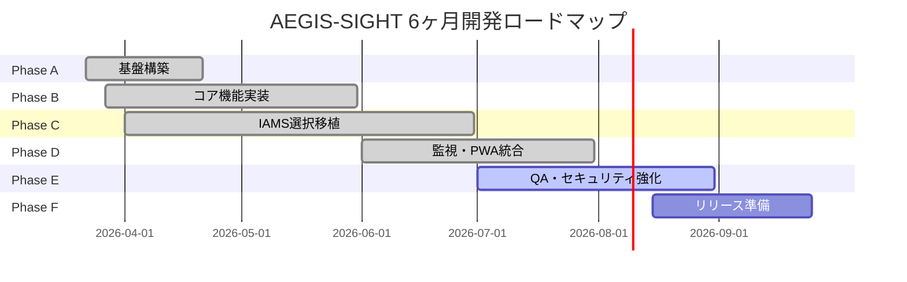
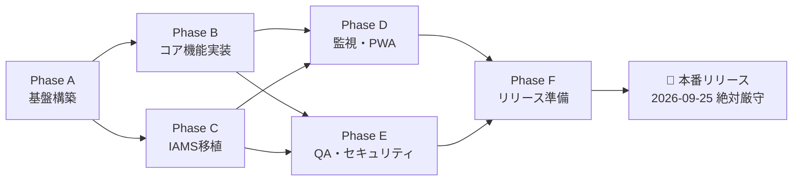

# AEGIS-SIGHT 全体開発フェーズ計画（6ヶ月リリース版）

| 項目 | 内容 |
|------|------|
| **プロジェクト名** | 🛡️ AEGIS-SIGHT |
| **組織** | みらい建設工業 IT部門 |
| **開発開始日** | 2026-03-25（プロジェクト登録日 / `state.json.project.registered_at`）|
| **リリース目標日** | **2026-09-25（本番リリース・絶対厳守 / `release_deadline`）** |
| **総開発期間** | 6ヶ月 |
| **技術スタック** | Python FastAPI / Next.js 16 / PostgreSQL 16 / Docker / PowerShell Agent |

> 🛡️ **最上位制約**: 本番リリース日 `2026-09-25` は [CLAUDE.md §1.5](../../../CLAUDE.md) / GitHub milestone `v1.0 Production Release` / `state.json` と一致する絶対期限。Cron 自動実行（月〜土・1 セッション 5 時間）下で運用し、残日数による自動縮退（[`release-deadline-watch.yml`](../../../.github/workflows/release-deadline-watch.yml)）を遵守する。

---

## 📊 全体フェーズ概要

---

## 📋 フェーズ一覧

| フェーズ | 名称 | 期間 | 状態 | 主要目標 |
|---------|------|------|------|---------|
| **Phase A** | 🏗️ 基盤構築 | 2026-03-22 〜 2026-04-21 | ✅ 完了 | インフラ・認証・CI/CD・スキャフォールド |
| **Phase B** | ⚙️ コア機能実装 | 2026-03-27 〜 2026-05-31 | ✅ 完了 | デバイス管理・アラート・ポリシー・SAM/調達API |
| **Phase C** | 🔄 IAMS選択移植 | 2026-04-01 〜 2026-06-30 | ✅ 完了 | IAMS pytest 1,798件変換・SAM・調達・M365移植 |
| **Phase D** | 📊 監視・PWA統合 | 2026-06-01 〜 2026-07-31 | ✅ 完了 | Prometheus/Grafana・PWA・全27ページチャート実装 |
| **Phase E** | 🛡️ QA・セキュリティ強化 | 2026-07-01 〜 2026-08-31 | 🔄 進行中 | テストカバレッジ90%+達成・型安全性改善・CI最適化 |
| **Phase F** | 🚀 リリース準備 | 2026-08-15 〜 2026-09-25 | ⏳ 未開始 | UAT・ドキュメント整備・社内公開（締切 09-25 絶対厳守）|

---

## 🔗 フェーズ間依存関係

---

## 📈 現在の進捗状況（2026-04-02時点）

| フェーズ | 進捗 | 完了済み主要成果物 |
|---------|------|-----------------|
| Phase A | ✅ 100% | プロジェクト基盤・CI/CD・認証・DB設計 |
| Phase B | 🔄 60% | デバイス管理API・アラート・ポリシー・セッション管理 |
| Phase C | 🔄 35% | IAMS pytest Phase45〜48完了（Phase100まで実装） |
| Phase D | ⏳ 0% | 未開始 |
| Phase E | ⏳ 0% | 未開始 |
| Phase F | ⏳ 0% | 未開始 |

### 実装済みAPIエンドポイント（2026-04-02時点）

| カテゴリ | エンドポイント数 | 実装状態 |
|---------|--------------|---------|
| 認証・ユーザー | `/auth/*`, `/users/*` | ✅ |
| デバイス管理 | `/devices/*` | ✅ |
| アラート管理 | `/alerts/*` | ✅ |
| ポリシー管理 | `/policies/*` | ✅ |
| セッション管理 | `/sessions/*` | ✅ |
| ログ管理 | `/logs/*` | ✅ |
| エクスポート | `/export/*` | ✅ |
| 印刷管理 | `/printing/*` | ✅ |
| リモートワーク | `/remote/*` | ✅ |
| M365統合 | `/m365/*` | ✅ |
| 通知管理 | `/notifications/*` | ✅ |
| 部署管理 | `/departments/*` | ✅ |
| ソフトウェア管理 | `/software/*` | ✅ |
| SAMライセンス | `/sam/*` | ✅ |
| 調達管理 | `/procurement/*` | ✅ |
| ナレッジベース | `/knowledge/*` | ✅ |
| SLA管理 | `/sla/*` | ✅ |
| 設定管理 | `/config/*` | ✅ |
| セキュリティ | `/security/*` | ✅ |
| ネットワーク | `/network/*` | ✅ |

---

## 🎯 マイルストーン

| マイルストーン | 日付 | 条件 |
|-------------|------|------|
| **M1: API基盤完成** | 2026-04-30 | 全APIエンドポイント実装・テスト |
| **M2: IAMS移植完了** | 2026-06-30 | IAMS 1,157テスト→pytest変換完了 |
| **M3: 監視基盤稼働** | 2026-07-31 | Prometheus/Grafana/PWA統合 |
| **M4: QA完了** | 2026-08-31 | テストカバレッジ80%・セキュリティ監査通過 |
| **M5: 本番リリース（絶対厳守）** | 2026-09-25 | UAT完了・本番環境デプロイ・GitHub milestone `v1.0 Production Release` close |

---

## 📂 詳細ドキュメント参照先

| フェーズ | ドキュメント |
|---------|------------|
| Phase A | [01_phase-a-foundation/](../01_phase-a-foundation/) |
| Phase B | [02_phase-b-core-features/](../02_phase-b-core-features/) |
| Phase C | [03_phase-c-iams-migration/](../03_phase-c-iams-migration/) |
| Phase D | [04_phase-d-observability-pwa/](../04_phase-d-observability-pwa/) |
| Phase E | [05_phase-e-qa-security/](../05_phase-e-qa-security/) |
| Phase F | [06_phase-f-release/](../06_phase-f-release/) |

---

*最終更新: 2026-04-02 | ClaudeOS v4 自律開発*
