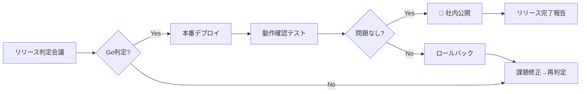

# Phase F: リリース準備（Release Preparation）

| 項目 | 内容 |
|------|------|
| **フェーズ** | Phase F |
| **名称** | 🚀 リリース準備 |
| **期間** | 2026-08-15 〜 2026-09-25（約 6 週間・締切 09-25 絶対厳守） |
| **状態** | ⏳ 未開始 |
| **担当** | CTO / DevOps / QA / 全チーム |
| **リリース種別** | 社内環境公開（Internal Release）+ 本番リリース（v1.0）|

> 🛡️ Phase F の終了は `release_deadline = 2026-09-25` と一致する絶対期限。残日数による自動縮退は [CLAUDE.md §1.5](../../../CLAUDE.md) / [`release-deadline-watch.yml`](../../../.github/workflows/release-deadline-watch.yml) を参照。

---

## 🎯 目標

みらい建設工業の社内IT環境にAEGIS-SIGHTをデプロイし、
IT部門によるフルサービス運用を開始する。

---

## 📋 リリースチェックリスト

### F-1: リリース判定基準（Go/No-Go）

| 判定項目 | 基準 | 状態 |
|---------|------|------|
| テストカバレッジ | ≥ 80% | ⏳ |
| CI/CD 全パス | 100% | ⏳ |
| セキュリティ監査 | Critical/High 0件 | ⏳ |
| UAT完了 | IT部門承認 | ⏳ |
| パフォーマンス | P95 < 200ms | ⏳ |
| ドキュメント | 全文書最終化 | ⏳ |
| 本番環境準備 | サーバー構築完了 | ⏳ |
| ロールバック手順 | 手順書作成・訓練 | ⏳ |

### F-2: 本番環境構築（Week 1-2）

| タスク | 内容 |
|--------|------|
| 本番サーバー構築 | 社内サーバー（Ubuntu 22.04 LTS） |
| Docker Compose 本番設定 | セキュリティ強化・ボリューム設定 |
| PostgreSQL 本番DB | バックアップ設定・接続制限 |
| Nginx リバースプロキシ | HTTPS設定・ロードバランシング |
| SSL/TLS 証明書 | 社内CA or Let's Encrypt |
| 環境変数・シークレット管理 | Docker Secrets or Vault |
| ファイアウォール設定 | 最小権限ポート開放 |

```yaml
# docker-compose.prod.yml（本番設定）
services:
  api:
    image: aegis-sight-api:latest
    restart: always
    environment:
      - DATABASE_URL=${DATABASE_URL}
      - SECRET_KEY=${SECRET_KEY}
      - ENVIRONMENT=production
    healthcheck:
      test: ["CMD", "curl", "-f", "http://localhost:8000/health"]
      interval: 30s
      timeout: 10s
      retries: 3

  web:
    image: aegis-sight-web:latest
    restart: always

  nginx:
    image: nginx:latest
    ports:
      - "443:443"
    volumes:
      - ./nginx/nginx.conf:/etc/nginx/conf.d/default.conf
      - ./certs:/etc/nginx/certs
```

### F-3: UAT（User Acceptance Testing）（Week 2-3）

| テストシナリオ | 担当 | 合格基準 |
|-------------|------|---------|
| デバイス一覧表示・検索 | IT担当者A | 500台全表示、検索1秒以内 |
| デバイス詳細・ステータス更新 | IT担当者A | 更新反映5秒以内 |
| アラート受信・確認・解決 | IT担当者B | アラート通知5分以内 |
| ポリシー設定・違反検知 | IT担当者B | ポリシー適用即時 |
| SAMライセンス管理 | IT担当者C | 期限切れアラート確認 |
| 調達申請・承認ワークフロー | IT担当者C/管理者 | 申請〜承認完了 |
| レポート出力（CSV/PDF） | IT担当者D | データ正確性確認 |
| ナレッジベース検索 | IT担当者D | 検索精度確認 |
| 管理者設定・ユーザー管理 | IT管理者 | 全設定機能確認 |
| オフライン動作（PWA） | 現場担当者 | オフライン50台表示確認 |

### F-4: 移行計画（Week 3-4）

| タスク | 内容 |
|--------|------|
| 既存システムデータ移行 | 既存デバイス台帳 → AEGIS-SIGHT DB |
| ユーザーアカウント作成 | IT部門全メンバー（約20名） |
| 初期デバイス登録 | 管理対象500台の初期登録 |
| PowerShellエージェント展開 | Windowsクライアント500台へ配布 |
| Grafanaダッシュボード設定 | IT管理者用・現場用ダッシュボード |
| 通知設定 | メール・Slackアラート設定 |

### F-5: 運用体制整備（Week 4-5）

| タスク | 内容 |
|--------|------|
| 運用手順書配布 | IT部門全員へ周知 |
| 管理者トレーニング | 2時間のハンズオン研修 |
| ヘルプデスク設定 | ナレッジベース活用 |
| バックアップ・監視確認 | 自動バックアップ動作確認 |
| エスカレーション手順 | 障害発生時の連絡体制 |
| SLA設定 | 稼働率99%・障害対応時間 |

### F-6: リリース実施（Week 5）



---

## 📊 リリース後モニタリング

| 指標 | 監視ツール | アラート閾値 |
|------|---------|-----------|
| システム稼働率 | Prometheus | < 99% |
| APIエラー率 | Prometheus | > 1% |
| レスポンスタイム | Grafana | P95 > 500ms |
| ディスク使用率 | Prometheus | > 80% |
| デバイスオフライン率 | Grafana | > 10% |

---

## 📅 リリース後フォローアップ

| 期間 | アクション |
|------|----------|
| リリース後1週間 | 毎日モニタリング・バグ即時修正 |
| リリース後1ヶ月 | 週次状況確認・改善要望収集 |
| リリース後3ヶ月 | 安定稼働確認・v1.1計画開始 |

---

*最終更新: 2026-04-02 | Phase F 計画済み*
